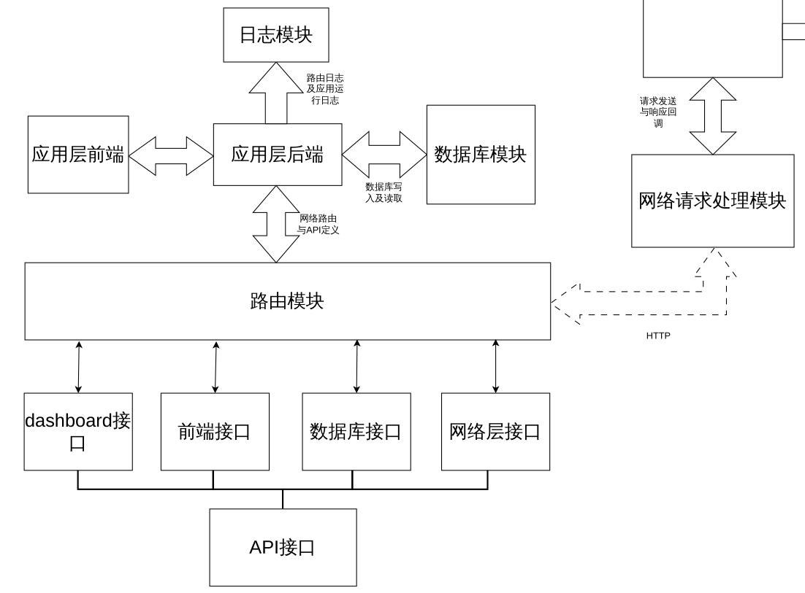
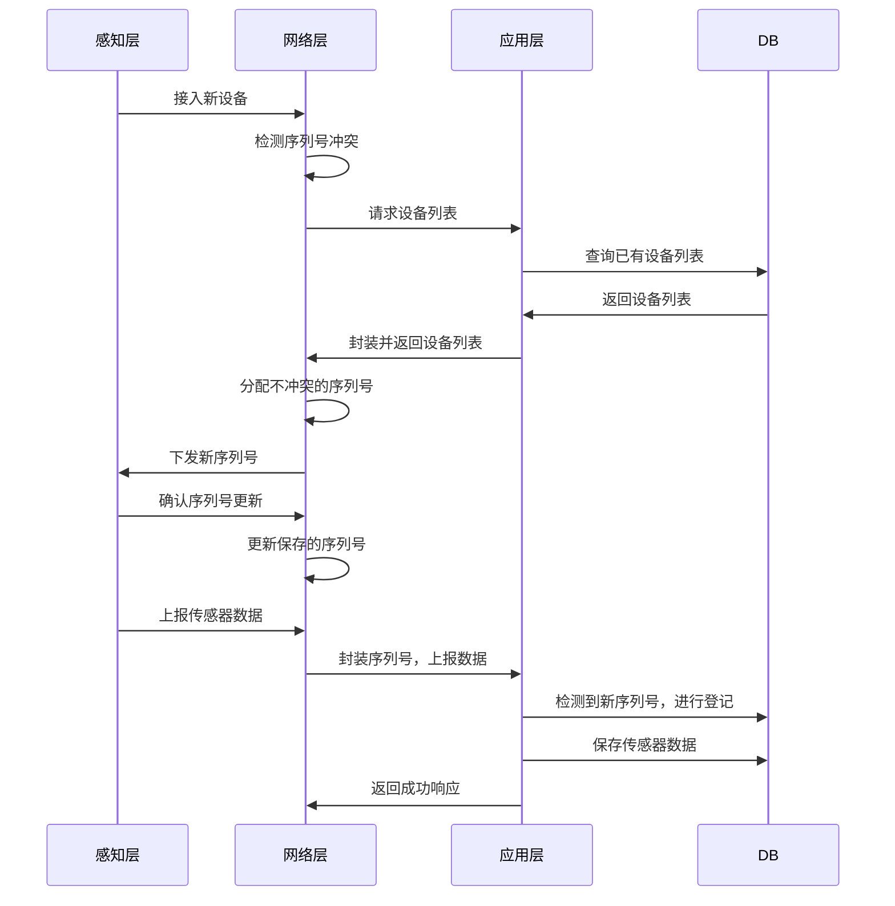
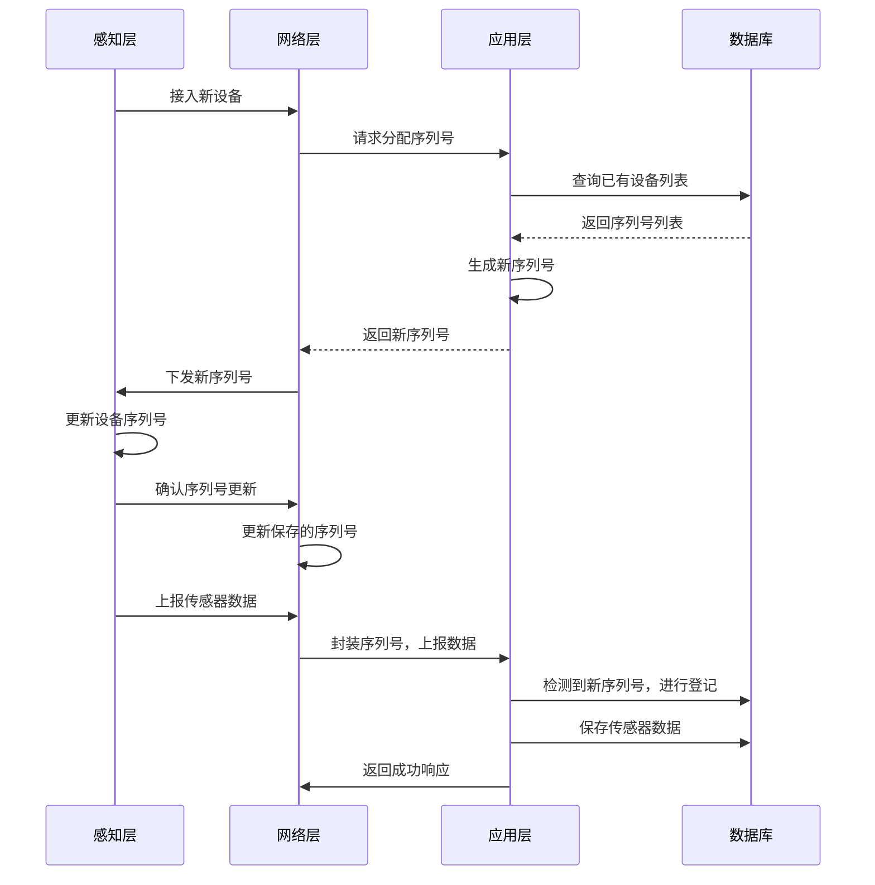

应用层设计如下：



该图以接口类型为主，省去了前后端的具体实现细节。后端的实现中，包含以下面的几个子模块：

- 管理数据库的模块dbObject
- 管理日志的模块myLogger

### 数据库模块（dbObject）

该模块包含四个功能：

- 初始化数据库
- 添加设备
- 删除设备
- 插入数据
- 获取数据
- 删除数据
- 退出时资源回收

数据库维护一个设备列表，这个设备列表包含所有已经被捕获的设备序列号以及捕获时间。

对于每个已知的设备，会单独维护一个该设备的数据表，包含它上报的所有传感器数据

> 该模块是支持分布式的，对于一个新的设备到来，只要保证它的设备序列号和已有的设备序列号不冲突，就可以自动将其加入已知设备列表，并存储它的数据。
>
> 关于设备序列号的冲突，放在网络层解决。

### 路由模块（routes）

该模块包含下面几个子部分：

- 传感器相关路由（sensor）
- 数据库操作相关路由（database）
- 其他路由（functional）

#### sensor

包含三个功能：添加，获取，移除传感器数据。


#### database


#### functional

### 日志模块（myLogger）

该模块单独创建一个Logger对象，将我们自己的程序日志和flask自带的日志区分开。

## 后端API设计

### 1 连通性测试

`/api/test`(GET,POST)

```python
"""发送"""
resp = requests.get("http://127.0.0.1:5353/api/test") # 可以是POST
print(resp.text)
resp.close()

"""接收"""
ok
```

### 2 传感器数据上报

`/api/submit_sensor_data`(POST)

```python
"""发送"""
data = {
    "device_seq":"a5642f3ecdb7",
    "temperature":25.0,
    "light":143,
    "hall":1,
    "timestamp":str(time.time())
}
resp = requests.post("http://127.0.0.1:5353/api/submit_sensor_data", json=data)
print(resp.text)
resp.close()

"""接收"""
{
  "device_seq": "a5642f3ecdb7",
  "hall": 1,
  "light": 143,
  "rcv_status": "ok",
  "rcv_time": "1774761066.8878157",
  "temperature": 25.0,
  "timestamp": "1774761066.873945"
}
```

### 3 传感器数据获取

`/api/fetch_sensor_data`(POST)

```python
"""发送"""
data = {
    "start": 0,
    "num": 2,
    "device_seq": "a5642f3ecdb7"
}
resp = requests.post("http://127.0.0.1:5353/api/fetch_sensor_data", json=data)
print(resp.text)
resp.close()

"""接收"""
[
  {
    "hall": 1,
    "id": 2,
    "light": 143,
    "temperature": 25.0,
    "timestamp": "1774761066.873945"
  },
  {
    "hall": 1,
    "id": 1,
    "light": 144,
    "temperature": 25.0,
    "timestamp": "1774761039.7766201"
  }
]
```

### 4 删除传感器数据

`/api/remove_sensor_data`(POST)

```python
"""发送"""
data = {
    "id": 1,
    "device_seq": "a5642f3ecdb7"
}
resp = requests.post("http://127.0.0.1:5353/api/remove_sensor_data", json=data)
print(resp.text)
resp.close()

"""接收"""
{
  "device_seq": "a5642f3ecdb7",
  "id": 1,
  "rcv_status": "success",
  "rcv_time": "1774761246.8751652"
}

```

### 5 获取设备列表

`/api/get_device_list`(GET, POST)

```python
"""发送"""
data = {}
resp = requests.post("http://127.0.0.1:5353/api/get_device_list", json=data)
print(resp.text)
resp.close()

"""接收"""
[
  "45123236a4c3",
  "a5642f3ecdb7"
]
```

### 6 序列号分配请求

`/api/distribute_seq`(POST)

>  第一版的设计中，对于自组织功能的实现，是通过如下方式实现：
>
> 当感知层接入一个新的设备，设备的序列号为0x0000_0000_0000,当网络层检测到设备序列号冲突时，向应用层请求设备列表，然后根据设备列表自动为感知层的设备分配一个不冲突的序列号，并将这个序列号加入到应用层的设备列表中，实现设备序列号的自动分配。流程图如下：



当前的实现存在如下问题：

1. 当接入设备较多时，设备列表会很庞大，单次分配需要网络层请求整个列表，造成不必要的网络带宽浪费
2. 当多个设备同时接入时，有极低概率存在网络层分配到相同的设备序列号

综合考虑，需要将分配序列号的功能上升到应用层执行，具体流程如下：

> 感知层接入新设备时，网络层检测到设备序列号为全0,向应用层发送分配序列号的请求（`/api/distribute_seq`），应用层根据数据库中的数据，生成一个新的序列号并返回给网络层；网络层收到序列号，将序列号发送给感知层，感知层更新自己的序列号并告知网络层更新当前的序列号，用于后续通信。



这种设计解决了上述的第一个问题，没有解决第二个问题。但是考虑到48bit的空间比较大，可以认为这种碰撞几乎不可能发生。

```python
"""发送"""
resp = requests.post("http://127.0.0.1:5353/api/distribute_seq")
print(resp.text)
resp.close()

"""接收"""
# 成功
{
  "device_seq": "99f774cf8061",
  "status": "ok",
  "timestamp": "1775029396.5894167"
}

# 失败
{
	"status": "error",
	"message": str(e),
	"timestamp": str(time.time())
}
```

