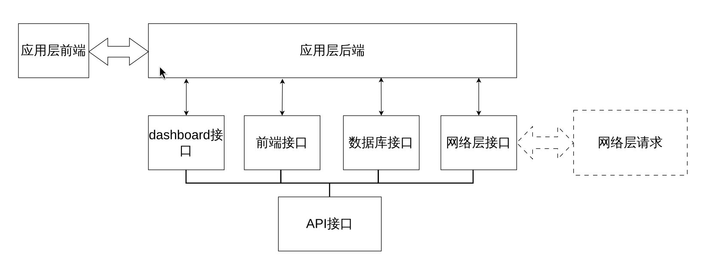

应用层设计如下：



该图以接口类型为主，省去了前后端的具体实现细节。后端的实现中，包含以下面的几个子模块：

- 管理数据库的模块dbObject
- 管理日志的模块myLogger

### dbObject模块

该模块包含四个功能：

- 初始化数据库
- 插入数据
- 获取数据
- 删除数据
- 退出时资源回收

数据库维护一个设备列表，这个设备列表包含所有已经被捕获的设备序列号以及捕获时间。

对于每个已知的设备，会单独维护一个该设备的数据表，包含它上报的所有传感器数据

> 该模块是支持分布式的，对于一个新的设备到来，只要保证它的设备序列号和已有的设备序列号不冲突，就可以自动将其加入已知设备列表，并存储它的数据。
>
> 关于设备序列号的冲突，放在网络层解决。

### myLogger模块

该模块单独创建一个Logger对象，将我们自己的程序日志和flask自带的日志区分开。

## 后端API设计

### 1 连通性测试

`/api/test`(GET,POST)

```python
"""发送"""
resp = requests.get("http://127.0.0.1:5353/api/test") # 可以是POST
print(resp.text)
resp.close()

"""接收"""
ok
```

### 2 传感器数据上报

`/api/submit_sensor_data`(POST)

```python
"""发送"""
data = {
    "device_seq":"a5642f3ecdb7",
    "temperature":25.0,
    "light":143,
    "hall":1,
    "timestamp":str(time.time())
}
resp = requests.post("http://127.0.0.1:5353/api/submit_sensor_data", json=data)
print(resp.text)
resp.close()

"""接收"""
{
  "device_seq": "a5642f3ecdb7",
  "hall": 1,
  "light": 143,
  "rcv_status": "ok",
  "rcv_time": "1774761066.8878157",
  "temperature": 25.0,
  "timestamp": "1774761066.873945"
}
```

### 3 传感器数据获取

`/api/fetch_sensor_data`(POST)

```python
"""发送"""
data = {
    "start": 0,
    "num": 2,
    "device_seq": "a5642f3ecdb7"
}
resp = requests.post("http://127.0.0.1:5353/api/fetch_sensor_data", json=data)
print(resp.text)
resp.close()

"""接收"""
[
  {
    "hall": 1,
    "id": 2,
    "light": 143,
    "temperature": 25.0,
    "timestamp": "1774761066.873945"
  },
  {
    "hall": 1,
    "id": 1,
    "light": 144,
    "temperature": 25.0,
    "timestamp": "1774761039.7766201"
  }
]
```

### 4 删除传感器数据

`/api/remove_sensor_data`(POST)

```python
"""发送"""
data = {
    "id": 1,
    "device_seq": "a5642f3ecdb7"
}
resp = requests.post("http://127.0.0.1:5353/api/remove_sensor_data", json=data)
print(resp.text)
resp.close()

"""接收"""
{
  "device_seq": "a5642f3ecdb7",
  "id": 1,
  "rcv_status": "success",
  "rcv_time": "1774761246.8751652"
}

```

### 5 获取设备列表

`/api/get_device_list`(GET, POST)

```python
"""发送"""
data = {}
resp = requests.post("http://127.0.0.1:5353/api/get_device_list", json=data)
print(resp.text)
resp.close()

"""接收"""
[
  "45123236a4c3",
  "a5642f3ecdb7"
]
```

