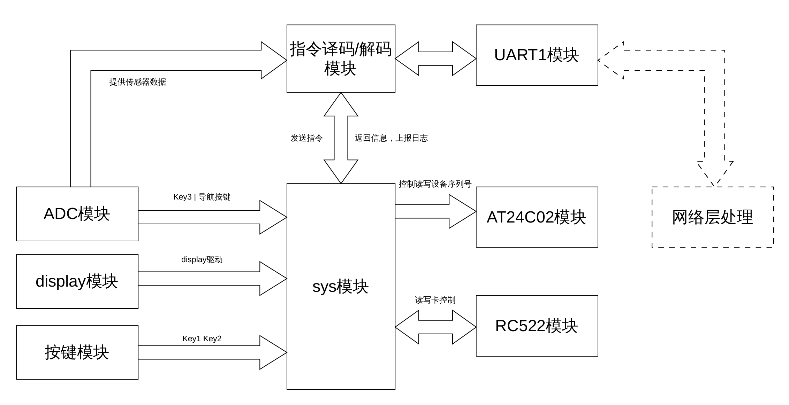
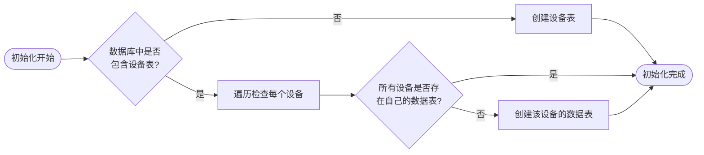
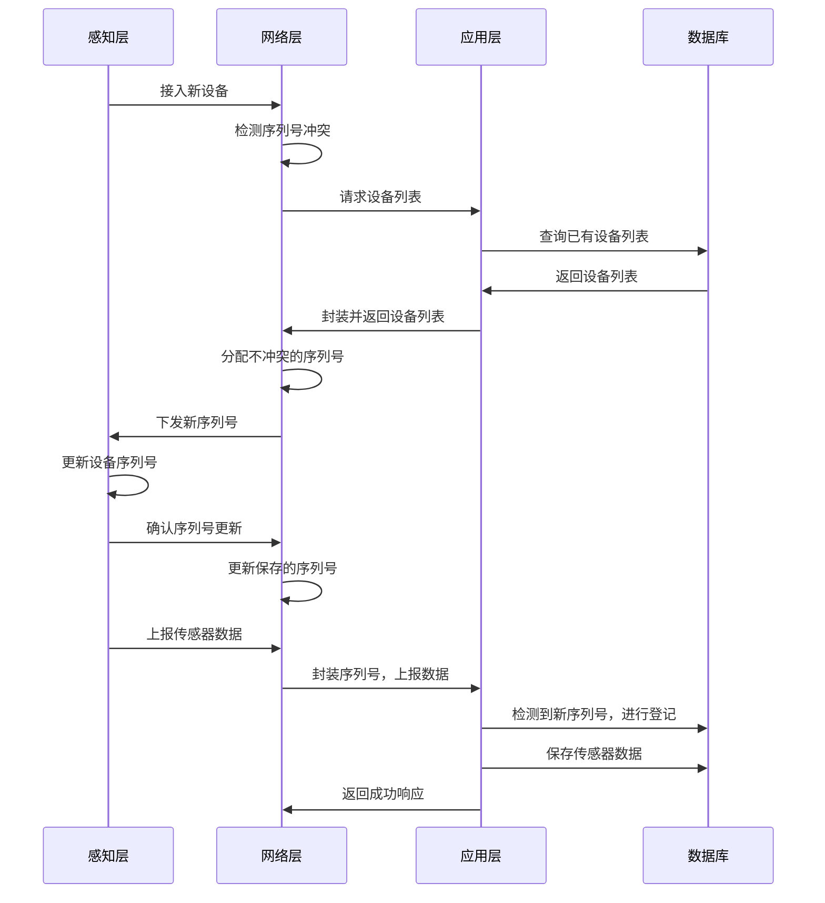
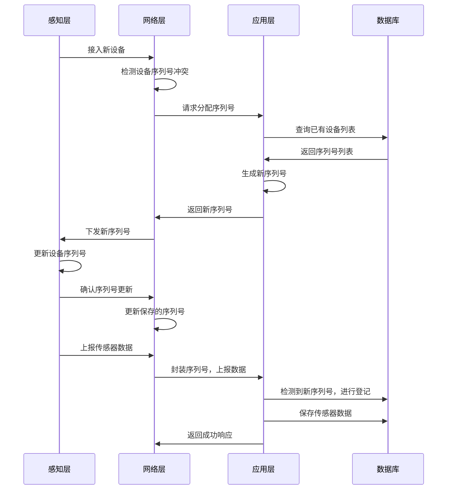

## 1 感知层功能设计

感知层设计如下：



### 1.1 模块

大部分模块在上学期嵌入式实验就已经实现，只做功能介绍。

#### 1.1.1 sys模块

这个模块是整体架构的核心，提供时间，按键，串口接收事件的回调函数绑定方法，可使用的函数及事件包括：

```c
extern void sysInit();
extern void setCallback(char id, userCallback user_callback); // 绑定用户的回调函数
extern void sysRun();

enum event{
	enumEventKey, // 按键按下（key1或key2）
	enumEventInt1, // 定时器0中断1次 -- 这三个中断相关的事件会直接在T0中断里调用
	enumEventInt10, // 定时器0中断10次
	enumEventInt100, // 定时器0中断100次
	enumEventUart1, // 串口1收到合法数据包
	enumEventAdcKey, // adc上的按键按下
	enumEventInt1000, // 中断1000次，1s后
	enumEventUart2 // 串口2收到数据包
};
```

#### 1.1.2 ADC模块

ADC模块实现导航按键以及各个传感器模拟值的获取，实现与上学期相比略作修改，将原本用作ADC值输入的P0和P1引脚取消初始化，防止与RC522模块配置冲突。

可使用函数及变量如下：

```c
typedef struct{
	unsigned int adcP0; // 弃用
	unsigned int adcP1; // 弃用
	unsigned int adcHall;
	unsigned int adcTem;
	unsigned int adcLum; // 注意光照使用int
	unsigned int adcNav;
} ADC;

extern void adcInit();
extern ADC getAdc();
extern unsigned char getADCKeyAct(unsigned char key);

enum adcKey{
	enumADCKey3,
	enumADCKeyRight,
	enumADCKeyDown,
	enumADCKeyCenter,
	enumADCKeyLeft,
	enumADCKeyUp
};
```

#### 1.1.3 RC522模块


#### 1.1.4 Display模块

显示模块，最常用的，可使用函数：

```c
extern void disInit(); // 初始化
extern void setLed(char led_vector); // led显示
extern void setSeg(char s0, char s1,char s2, char s3,char s4, char s5,char s6, char s7); // 数码管显示
extern void disRun(); // 每次调用显示某一个数码管或者led，也就是说调用9次可以显示所有数码管和led（sysRun中已经调用）
extern void setNum(unsigned long num); // 设置数码管显示一个数字
extern void addPoint(unsigned char cur); // 为某个位置增加小数点
```

#### 1.1.5 按键模块

可以控制Key1和Key2，按下后会触发sys中的事件，可用：

```c
extern unsigned char getKeyAct(unsigned char key); // 判断key是否按下

enum keyName{
	enumKey1,
	enumKey2
};

enum keyAct{
	enumKeyNULL,
	enumKeyPress
};
```

#### 1.1.6 AT24C02模块

用于读写AT24C02芯片中的256个字节：

```c
extern void ATInit(); // 初始化
extern unsigned char rAT(unsigned char addr); // 读取addr的数据
extern void wAT(unsigned char addr, unsigned char val); // 写入数据
```

#### 1.1.7 指令译码/解码模块

这个模块依赖sys中的enumEventUart1事件，当上位机发来指令后，uart1收到数据帧，会触发sys的串口1事件，进入串口1回调函数，该模块在回调函数中对封装的数据帧进行偶校验判断，指令解码，根据不同的指令，执行不同操作。

该模块还需要将需要返回给上位机的数据封装为数据帧，具体封装方式参照`感知层-网络层通信协议`，调用串口模块将数据发送出去。

#### 1.1.8 UART1模块

该串口模块设计较为简陋（早期的设计，但是一直没有改），接收等长的数据包，可以设置数据保存的位置，以及数据包头。

```c
extern void uart1Init(unsigned long baudrate);
extern void uart1Send(unsigned char* content, unsigned char num); // 发送的数据，指针和大小
extern void setUart1Buf(unsigned char* buf, unsigned char buf_num, unsigned char* head, unsigned char head_num); // 设置接收到数据后保存的位置和包头
```

### 1.2 功能

这一层的主要任务是获取传感器数据，以及外接RC522实现读写卡，本体设计较为简单，难点在于设计读写卡的时序并完成一系列相关操作。程序分为三个模式：

1. mode0：待机模式
2. mode1：检测模式
3. mode2：设置模式

下面分开介绍三种模式。

#### 1.2.1 MODE0 待机模式

该模式为上电后进入的状态，此时可以用来测试程序正确性，包含如下交互功能：

- key1 - 读取当前RFID的序列号，通过串口输出
- key2 - 切换下一个模式
- key3 - 读取当前RFID的序列号以及位于地址20的16字节数据，通过串口返回，共20字节

数码管显示为当前设备的序列号，led显示表示当前显示的是哪三个字节，L0-L2代表低三个字节，L3-L5代表高三个字节。

- 通过NavUp/NavDown切换当前显示
- 按下NavCenter会将设备序列号重置为全0，这个操作可以配合网络层和应用层的自组织功能实现设备序列号更新

#### 1.2.2 MODE1 检测模式

该模式下系统进入检测RFID的状态，每隔1S检测一次RFID，如果检测到RFID，流水灯并在数码管上显示RFID的uid，此时可以与RFID进行通信。

该模式每隔30s会向网络层上报一次传感器数据。

#### 1.2.3 MODE2 设置模式

pass

## 2 感知层-网络层通信协议

RFID部分：

- 读卡
  - 获取RFID的uid
  - 读取地址（0-63，不包括4*i+3）
- 写卡
  - 写入某个地址的16字节

### 2.1 $感知层 \to 网络层$:

使用不等长编码，通常的数据帧格式为：

**数据包头AA55+字节数+指令字节+数据包+偶校验**

> 偶校验包含数据包头和字节数，字节数指除包头和字节数的部分（指令字节+数据包+偶校验）

#### 指令字节

- 00 - 获取RFID的uid（RFID操作）
- 01 - 获取某个地址的数据（RFID操作）
- 02 - 写入某个地址的数据（RFID操作）
- 03 - 获取传感器数据（从机操作）
- 04 - 向从机写入其序列号（从机操作）
- 05 - 获取从机序列号（从机操作）
- FF - DEBUG指令（主机操作）

#### 00 获取uid

收到获取uid信息后，底层调用PcdRequest函数，并尝试获取uid，获取到后编码返回：
`aa 55 06 00 d1 d2 d3 d4 xx`
其中6为数据包字节数，00为指令字节，xx为偶校验

#### 01 获取某个地址的数据

单片机需要获取到数据后返回：
`aa 55 13 01 addr d1-d16 xx`
0x13为数据包字节数，包含指令字节1+读取地址1+数据字节16+偶校验1

#### 02 写入某个地址数据

单片机需要根据提供的地址，将数据写入，返回状态信息：
`aa 55 xx 02 sig d1-d16 xx`
这条指令分两种情况：

- 写入成功时，返回19个字节，包含指令字节1+返回状态1+数据16+偶校验
  此时字节数为19=0x13，返回状态为非0值，原样返回16字节数据，以及偶校验
  返回数据帧格式：`aa 55 13 02 01 d1-d16 xx`
- 写入失败时，返回3个字节，包含指令字节1+返回状态1+偶校验1
  返回状态为0,表示失败
  返回数据帧格式：`aa 55 03 02 00 xx`

#### 03 获取传感器数据

传感器数据包括：温度，光照，霍尔，振动

单片机受到获取传感器数据的指令时，需要将传感器数据封装返回：
`aa 55 08 03 t1 t0 i1 i0 hall shake xx`
t1,t0为温度值，i1,i0为光照，hall为霍尔，shake为振动

#### 04 写入从机序列号

这条指令用于向从机的**AT24C02芯片**写入一段序列号（6字节），用于唯一标识从机。

保存的地址：0x50-0x0x55，大端保存

- 写入成功后，返回：
  `aa 55 08 04 d1-d6 xx`
  包头2+字节数1+指令1+序列号6+偶校验1
- 写入失败，返回：
  `aa 55 03 04 00 xx`
  包头2+字节数1+指令1+零字节1+偶校验1

#### 05 获取从机序列号

这条指令用于从从机的地址0x50-0x55获取序列号并返回。

收到获取序列号的数据帧后，返回：

`aa 55 08 05 d1-d6 xx`

包头2+字节数1+指令1+序列号6+偶校验1

#### FF DEBUG指令

主机操作，仅$感知层 \to 网络层$**单向指令**，网络层不返回任何信息

1. 单字节指令固定为6个字节，包头2（AA55）+字节数1（3）+命令字节1（FF）+DEBUG值1+校验码1
   `aa 55 03 FF xx chk_sum`，DEBUG值任意，校验码依然为偶校验

2. 多字节指令，字节数可以任意，但是要满足字节数和偶校验匹配
   `aa 55 num FF xx ... xx chk_sum`，`num`为字节数，`xx`为DEBUG数据，`chk_sum`为偶校验

### 2.2 $网络层 \to 感知层$:

> 连接层GUI在输入内容时需要遵循如下规则：
>
> 1. 所有数据以16进制数字显示，每个字节之间以Space分割
> 2. 写入数据时，第一个字节为地址，后16个字节为数据

连接层到感知层为等长编码，所有数据包固定为24字节，起始两字节固定为AA55，最后一字节固定为偶校验，中间的字节传输指令，不足用00补齐。

一条数据的格式包括：

**数据包头+指令字节+数据+偶校验**

指令字节同前述。

#### 00 获取uid

此时主机需要发送获取uid的指令：
`aa 55 00 00 00 ... 00 00 xx`
第二字节的00为指令，最后的xx为偶校验，其余00为补齐字节
包头2+指令1+补齐20+偶校验1

#### 01 获取某个地址的数据

`aa 55 01 addr 00 00 ... 00 00 xx`
01为指令字节，addr为要获取的地址（0-63）
包头2+指令1+地址1+补齐19+偶校验1

#### 02 写入某个地址的数据

`aa 55 02 addr d1-d16 00 00 00 xx`
数据包长24字节，包头2+指令1+地址1+数据16+补齐3+偶校验1

#### 03 获取传感器数据

连接层需要发送获取传感器数据的指令：
`aa 55 03 00 ... 00 xx`

包头2+指令1+补齐20+偶校验1

#### 04 写入从机序列号

这条指令网络层需要传输从机序列号：

`aa 55 04 d1-d6 00 ... 00 xx`

包头2+指令1+序列号6+补齐14+偶校验1

#### 05 获取从机序列号

网络层发送获取从机序列号的数据帧：

`aa 55 05 00 ... 00 xx`

包头2+指令1+补齐20+偶校验1

网络层功能如下：

- 感知层串口控制
- 向感知层发送命令并接收信息
- 向应用层上报信息

## 3 网络层功能设计

网络层功能概图如下：


### 3.1 程序结构

项目目录如下：（暂时）

```bash
├── log
│   ├── 2026_03_29.log
├── main.py
├── model
│   ├── __init__.py
│   ├── serialThread.py
│   └── web_model.py
├── pyproject.toml
├── README.md
├── scripts
│   ├── checksum.py
│   └── tmp.py
├── test.ui
└── uv.lock
```

- main.py为程序主文件，包含主窗口定义，UI加载，交互逻辑实现，子模块控制等。
- model保存自定义的模块设计，主要是串口模块与网络请求控制模块
- scripts保存临时测试的脚本文件
- test.ui为GUI设计文件

### 3.2 感知层控制

这部分主要依赖`serialThread`与感知层串口进行通信。

- 当用户点击交互按钮后，会出发交互按键绑定的handler，然后分析交互事件并进行正确的数据帧封装，通过串口发送命令

- 当感知层返回数据时，首先在`serialThread`进行数据帧合法性检验，不符合通信协议的数据帧会被直接抛弃，符合通信协议的数据帧会通过`data_received`信号发送给`QMainWondow`并触发信号回调函数，该函数中对数据帧进行解封装处理，并将受到的数据更新到UI界面。

可进行的操作：

- 获取RFID的UID
- 获取RFID某个地址的数据
- 向RFID某个地址写入数据
- 获取传感器数据

设备序列号的管理：

- 每个设备都有一个独立的设备序列号用于唯一标识这个设备，序列号为6个字节，保存在感知层AT24C02芯片的地址0x50-0x55。

- 网络层可以控制设别的序列号（读/写）
- 每次连接新的设备时，自动获取其序列号，如果检测到设备无序列号，则向上层汇报，应用层会分配一个新的序列号传回。网络层获取到新的序列号后，更新感知层的序列号。

> 由于自组织功能改版，网络层的序列号控制更改为前述的设计，下面是第一版的设计，已经弃用。
>
> - 网络层可以控制连接设备的序列号（读/写），应用层可以自发将新的设备加入数据库。
> - 网络层需要控制设备序列号，具体操作为：
>   - 当感知层传入非全0的序列号，正常上报数据
>   - 当感知层传入全0的序列号，此时不上报数据，先向应用层申请设备列表，然后分配一个不冲突的设备序列号给当前设备，感知层收到这个设备序列号后更新自己的序列号并重发数据。

### 3.3 应用层控制

应用层的通信主要是网络层上报传感器数据，需要提供如下信息：

- 感知层上报的传感器信息（包含温度，光照，霍尔以及时间戳）

此外还有自组织功能需要的：

- 请求设备列表（第一版，弃用，但接口保留）
- 请求分配序列号（第二版）

> 其中时间戳无法在感知层一侧精确获取（DS1302存在较大误差），所以时间戳从网络层获取，存在传输的一点误差。

### 3.4 网络请求模块

#### 3.4.1 webModel模块

该模块负责与应用层的网络通信，内部创建一个webThread。目前支持两个通信的功能：

- 上报传感器数据（submit_sensor_data）
- 获取设备列表（get_device_list）

> 具体API使用方式参考`应用层功能设计`

由于网络请求是异步的，所以请求会提交给webThread处理。

当请求得到响应后，webThread会将响应题按照如下形式封装，并通过信号`resp_signal`提交给webModel，webModel可以在函数`resp_parse`中进行处理（比如继续向SerialToolWindow发送信号）

目前包含三个主要功能：

- **提交传感器数据**

- **请求序列号**

- **获取设备列表**

三个功能实现逻辑相同，即封装请求信息，将请求加入到子线程的请求队列中，例如提交传感器的函数：

```python
def submit_sensor_data(self, device_seq: bytes, temp: float, light: int, hall: int):
    """提交传感器数据"""
    url = f"{self.par.base_url}/api/submit_sensor_data"

    data = {
        "device_seq": device_seq.hex(),
        "temperature": temp,
        "light": light,
        "hall": hall,
        "timestamp": str(time.time()),
    }
```

子线程获取到响应后，会从信号槽返回响应

响应返回格式：

```python
data = {
    "status": resp.status_code, # 返回的状态码
    "url": resp.url, # 请求的url
    "resp": resp.text # 返回的响应内容
}
```

这个格式的数据会继续传送到主线程，交由主线程的相关函数处理。

#### 3.4.2 webThread模块

该模块为webModel的子模块，用于发送webModel需要的请求。内部维护两个资源：会话session和请求队列`requests_queue`。

当请求传来时，该请求会被放入请求队列；线程主循环会不断从队列中获取请求，当获取到请求后向目标服务器发送该请求，得到相应后通过信号槽`resp_signal`将响应返回。

提供的功能主要是两个：

- **添加待执行请求**
- **执行请求**

添加请求：把请求加入队列

```python
def add_request(self, url: str, method: str, data: dict = None):
    if not self.requests_queue.full():
        self.requests_queue.put((url, method, data))
    else:
        self.par.par.log.warning(f"运行函数[add_request]错误：请求队列已满，新增请求失败：{(url, method, data)}")
```

执行请求：从队列中取出一条请求执行

```python
def _do_requests(self, url: str, method: str, data: dict | None):
    """执行请求的函数"""
    method = method.upper()
    try:
        if method == "GET":
            resp = self.session.get(url, timeout=REQUESTS_TIMEOUT)
            data = {
                "status": resp.status_code,
                "url": resp.url,
                "resp": resp.text
            }
            self.resp_signal.emit(data)
        elif method == "POST":
            resp = self.session.post(url, json=data, timeout=REQUESTS_TIMEOUT)
            data = {
                "status": resp.status_code,
                "url": resp.url,
                "resp": resp.text
            }
            self.resp_signal.emit(data)
    except Exception as e:
        self.par.par.log.error(f"运行函数[_do_requests]错误：{e}")
```

线程运行函数：轮询请求队列，有请求则取出执行

```python
def run(self):
    while self._is_running.is_set():
        try:
            url, method, data = self.requests_queue.get(timeout=QUEUE_TIMEOUT)
            self._do_requests(url, method, data)
        except:
            continue
```

### 3.5 serialThread模块

该模块管理与串口通信相关的部分。

包含串口的开关，串口数据的发送和接收。

串口打开后，串口线程会不断从串口获取数据，当获取到符合通信协议的数据帧时，通过`data_receive`信号将数据交给MainWindow中的回调函数处理。

#### 3.5.1 打开串口

```python
def open_serial(self, port: str = "COM5", baudrate: int = 9600, timeout: float = 1.0):
    try:
        self.serial.port = port
        self.serial.baudrate = baudrate
        self.timeout = timeout
        self.serial.open()
        self.par.log.info(f"串口打开成功！(port: {port} baudrate: {baudrate} timeout: {timeout:.1f})")
    except Exception as e:
        self.par.log.error(f"串口打开失败:{e}")
```

#### 3.5.2 关闭串口

```python
def close_serial(self):
    if self.serial and self.serial.is_open:
        self.serial.close()
        self.par.log.info("串口关闭成功！")
    else:
        self.par.log.warning("串口已关闭！")
```

#### 3.5.3 发送数据

```python
def send_data(self, data: bytes):
    if self.serial and self.serial.is_open:
        self.serial.write(data)
        self.par.log.debug(f"数据发送成功：{self._to_hex_stream(data)}")
    else:
        self.par.log.warning(f"串口未打开，数据发送失败：{self._to_hex_stream(data)}")
```

#### 3.5.4 线程主循环/数据接收

接收数据包时，需要根据前文定义的`2 感知层-网络层通信协议`，感知层到网络层是不等长数据帧，首先检测包头`AA 55`，然后获取要读取的数据字节数，之后读取数据，进行偶校验检验，合法将数据帧发送给主线程处理。

(下面的代码是精简版本，以实际代码为准)

```python
def run(self):
    head = [0xaa, 0x55] # 数据包头
    data = b""
    while self.is_running.is_set():
        if self.serial and self.serial.is_open:
              data = self.serial.read(2)
              if data and data[0] == head[0] and data[1] == head[1]:
                  num = self.serial.read(1)
                  if num:
                      num = int.from_bytes(num, "big")
                  else:
                      continue
                  content = self.serial.read(num) # 读取实际的数据和校验位
                  content = data+num.to_bytes(1, "big")+content
                  if(self._check_sum(content)):
                      self.par.log.info(f"收到合法数据包：{content.hex()}")
                      self.data_received.emit(content)
                  else:
                      self.par.log.warning(f"收到数据包，但是未通过偶校验：{content.hex()}, 偶校验结果：{self._check_sum(content)}")
              else:
                  continue
        else:
            self.msleep(100)
        data = b"" # 处理完一次清空缓冲区
```


## 4 网络层-应用层通信协议

网络层与应用层的通信经过`HTTP协议`进行，包含下面几个部分：

1. 应用层API设计中，与网络层通信的部分
2. 网络层API调用封装为交互界面
3. 网络层自动获取感知层数据并调用API向应用层发送

具体的API使用方法参考`5.4 后端API使用`部分。

## 5 应用层功能设计

应用层设计如下：


该图以接口类型为主，省去了前后端的具体实现细节。后端的实现中，包含以下面的几个子模块：

- 管理数据库的模块dbObject
- 管理日志的模块myLogger

### 5.1 数据库模块（dbObject）

该模块包含四个功能：

- 初始化数据库
- 添加设备
- 删除设备
- 插入数据
- 获取数据
- 删除数据
- 退出时资源回收

数据库维护一个设备列表，这个设备列表包含所有已经被捕获的设备序列号以及捕获时间。

对于每个已知的设备，会单独维护一个该设备的数据表，包含它上报的所有传感器数据。

> 该模块是支持分布式的，对于一个新的设备到来，只要保证它的设备序列号和已有的设备序列号不冲突，就可以自动将其加入已知设备列表，并存储它的数据。
>
> 关于设备序列号的冲突，放在网络层解决。

数据库模块代码较多，因此不在设计中展现，具体可参考实际代码设计，此处仅介绍实现思路。数据库整体使用python的sqlite3实现，不使用mysql主要是因为数据库连接较为麻烦，考虑到后续服务器部署等操作，使用更轻量的sqlite做有效性验证。如果后续部署实际场景，需要将这个模块替换为mysql版本。

#### 5.1.1 初始化

初始化时需要检查当前数据库中是否包含设备表，如果没有则创建设备表。

如果存在已有设备表，检查每个设备是否存在自己的数据表，如果没有则创建。具体的流程图如下：



#### 5.1.2 数据表

##### 添加数据

这个函数是实现数据持久化的以及网络自组织的核心功能，具体如下：

1. 当调用这个函数时，检查传入数据的来源（设备序列号）
2. 如果序列号包含在设备表中并且存在数据表，则直接将数据加入到数据表中
3. 如果序列号不包含在设备表中，则先将设备加入设备表中，然后创建设备的数据表，并将数据加入数据表

返回值：

- 成功：`True`

- 失败：`False`

##### 获取数据

从数据表中获取数据并返回。

返回值：

- 成功：`[dict(sensor_data) for row in read_data]`
- 失败：`[]`

##### 删除数据

从某个数据表中删除某条数据

返回值：

- 成功：`{"status": "success", "message": "删除成功"}`

- 失败：

  ```python
  {"status": "error", "message": "缺少 device_seq 参数"}
  {"status": "error", "message": "无效的ID"}
  {"status": "not_found", "message": f"ID为{id}的数据不存在"}
  {"status": "error", "message": str(e)}
  ```

#### 5.1.3 设备表

##### 获取设备列表

从设备表中获取所有设备信息并返回一个列表

返回值：

- 成功：`[device_list]`
- 失败：`[]`

##### 添加设备

虽然系统设计是自组织的，但是仍然提供手动添加和删除设备的功能。

首先检查设备表中是否已经存在该设备，如果存在返回设备已存在信息；如果不存在则将设备加入设备表，然后创建设备的数据表。

返回值：

- 成功：`{"status": "success", "message": "添加成功"}`

- 失败：

  ```pyhton
  {"status": "error", "message": "缺少设备序列号参数"}
  {"status": "exist", "message": f"设备 {seq} 已存在"}
  {"status": "error", "message": str(e)}
  ```

##### 删除设备

检查设备是否存在，如果不存在返回设备未找到信息；如果存在删除设备的数据表，并从设备表中将该设备删除。

返回值：

- 成功：`{"status": "success", "message": "delete success"}`

- 失败：

  ```python
  {"status": "error", "message": "缺少设备序列号参数"}
  {"status": "not_found", "message": f"设备 {seq} 不存在"}
  {"status": "error", "message": str(e)}
  ```

#### 5.1.4 用户表

##### 初始化

用户表为框架建立后新加部分，因此相对独立，初始化函数单独编写后在dbObject的`__init__`中调用。

检查是否存在用户表，如果不存在则创建，表项如下：

```sqlite
CREATE TABLE IF NOT EXISTS auth(
    id INTEGER PRIMARY KEY AUTOINCREMENT,
    username TEXT UNIQUE NOT NULL,
    password_hash TEXT NOT NULL,
   	timestamp TEXT NOT NULL
)
```

##### 添加用户

将一个用户添加进用户表中，记录当前的时间戳，将密码进行sha256哈希后一并保存进表中。

返回值：

- 成功：`{"status": "success", "message": "添加成功"}`

- 失败：

  ```python
  {"status": "error", "message": "缺少用户名参数"}
  {"status": "error", "message": "缺少密码参数"}
  {"status": "exist", "message": f"用户 {username} 已存在"}
  {"status": "error", "message": str(e)}
  ```

##### 删除用户

从表中查找目标用户，如果存在则删除

返回值：

- 成功：`{"status": "success", "message": "删除成功"}`

- 失败：

  ```python
  {"status": "error", "message": "缺少用户名参数"}
  {"status": "not_found", "message": f"用户 {username} 不存在"}
  {"status": "error", "message": str(e)}
  ```

##### 获取用户密码哈希值

从表中查找用户，存在则返回其密码的哈希值

返回值：

- 成功：`{"status": "success", "password_hash": password_hash}`

- 失败：

  ```python
  {"status": "error", "message": "缺少用户名参数"}
  {"status": "not_found", "message": f"用户 {username} 不存在"}
  {"status": "success", "password_hash": password_hash}
  {"status": "error", "message": str(e)}
  ```

### 5.2 路由模块（routes）

该模块包含下面几个子部分：

- 传感器相关路由（sensor）
- 数据库操作相关路由（database）
- 其他路由（functional）

#### 5.2.1 sensor

包含三个功能：添加，获取，移除传感器数据。

三个功能实现的过程类似，即：

1. 从请求中提取参数
2. 调用dbOdject中相关的函数对数据库操作
3. 封装返回响应体并返回

例如移除传感器数据的路由：

```python
"""移除传感器数据"""
@sensor_route.route("/remove_sensor_data", methods=["POST"])
def remove_sensor_data_handler():
    data = request.get_json()

    status = db.remove_sensor_data(data.get("id"), data.get("device_seq"))

    data["rcv_status"] = status.get("status")
    data["rcv_time"] = str(time.time())
    return make_response(jsonify(data), 200 if data["rcv_status"] == "success" else 400)
```

#### 5.2.2 database

获取设备列表的路由，思路与前述`sensor`类似：

```python
"""获取设备列表"""
@database_bp.route("/get_device_list", methods=["GET", "POST"])
def get_device_list_handler():
    device_list = db.get_device_list()
    return make_response(jsonify(device_list), 200)
```

#### 5.2.3 functional

分配设备序列号的路由：

1. 从数据库中获取设备列表
2. 生成一个不冲突的序列号
3. 封装响应体并返回

> 由于只是生成一个随机6字节数，所以实际实现直接在路由模块中，没有单独开线程。

```python
def generate_device_seq(existing_devices: list) -> str:
    """生成不与现有设备冲突的12位十六进制序列号"""
    max_attempts = 100
    for _ in range(max_attempts):
        new_seq = secrets.token_hex(6)  # 生成12位十六进制字符串
        if new_seq not in existing_devices:
            return new_seq
    raise Exception("无法生成唯一的设备序列号，请稍后重试")

@functional.route("/distribute_seq", methods=["POST"])
def distribute_seq_handler():
    device_list = db.get_device_list()
    try:
        new_seq = generate_device_seq(device_list)
        rsp = {
            "device_seq": new_seq,
            "status": "ok",
            "timestamp": str(time.time())
        }
        return make_response(jsonify(rsp), 200)
    except Exception as e:
        rsp = {
            "status": "error",
            "message": str(e),
            "timestamp": str(time.time())
        }
        return make_response(jsonify(rsp), 500)
```

### 5.3 日志模块（myLogger）

该模块单独创建一个Logger对象，将我们自己的程序日志和flask自带的日志区分开。

本质就是创建一个新的Logger对象并将其索引到我们的日志目录，并进行一些配置。

```python
class myLogger(logging.Logger):
    def __init__(self):
        super().__init__(__name__)

        # 确保日志目录存在
        if not os.path.exists(SAVE_LOG_PATH):
            os.makedirs(SAVE_LOG_PATH)

        # 创建文件 handler（只输出到文件，不影响控制台）
        handler = logging.FileHandler(
            os.path.join(SAVE_LOG_PATH, LOG_FILE_NAME),
            encoding="utf-8"
        )
        handler.setLevel(logging.DEBUG)
        handler.setFormatter(logging.Formatter(
            "%(asctime)s - %(name)s - %(levelname)s - %(message)s",
            datefmt="%Y-%m-%d %H:%M:%S"
        ))

        # 添加 handler 到当前 logger
        self.addHandler(handler)
```

### 5.4 后端API使用

#### 5.4.1 连通性测试

`/api/test`(GET,POST)

```python
"""发送"""
resp = requests.get("http://127.0.0.1:5353/api/test") # 可以是POST
print(resp.text)
resp.close()

"""接收"""
ok
```

#### 5.4.2 传感器数据上报

`/api/submit_sensor_data`(POST)

```python
"""发送"""
data = {
    "device_seq":"a5642f3ecdb7",
    "temperature":25.0,
    "light":143,
    "hall":1,
    "timestamp":str(time.time())
}
resp = requests.post("http://127.0.0.1:5353/api/submit_sensor_data", json=data)
print(resp.text)
resp.close()

"""接收"""
{
  "device_seq": "a5642f3ecdb7",
  "hall": 1,
  "light": 143,
  "rcv_status": "ok",
  "rcv_time": "1774761066.8878157",
  "temperature": 25.0,
  "timestamp": "1774761066.873945"
}
```

#### 5.4.3 传感器数据获取

`/api/fetch_sensor_data`(POST)

```python
"""发送"""
data = {
    "start": 0,
    "num": 2,
    "device_seq": "a5642f3ecdb7"
}
resp = requests.post("http://127.0.0.1:5353/api/fetch_sensor_data", json=data)
print(resp.text)
resp.close()

"""接收"""
[
  {
    "hall": 1,
    "id": 2,
    "light": 143,
    "temperature": 25.0,
    "timestamp": "1774761066.873945"
  },
  {
    "hall": 1,
    "id": 1,
    "light": 144,
    "temperature": 25.0,
    "timestamp": "1774761039.7766201"
  }
]
```

#### 5.4.4 删除传感器数据

`/api/remove_sensor_data`(POST)

```python
"""发送"""
data = {
    "id": 1,
    "device_seq": "a5642f3ecdb7"
}
resp = requests.post("http://127.0.0.1:5353/api/remove_sensor_data", json=data)
print(resp.text)
resp.close()

"""接收"""
{
  "device_seq": "a5642f3ecdb7",
  "id": 1,
  "rcv_status": "success",
  "rcv_time": "1774761246.8751652"
}

```

#### 5.4.5 获取设备列表

`/api/get_device_list`(GET, POST)

```python
"""发送"""
data = {}
resp = requests.post("http://127.0.0.1:5353/api/get_device_list", json=data)
print(resp.text)
resp.close()

"""接收"""
[
  "45123236a4c3",
  "a5642f3ecdb7"
]
```

#### 5.4.6 添加设备

`/api/add_device`(POST)

```python
"""发送"""
data = {
    "device_seq": "a5642f3ecdb7",
    "timestamp": str(time.time())
}
resp = requests.post("http://127.0.0.1:5353/api/add_device", json=data)
print(resp.text)
resp.close()

"""接收"""
# 成功
{
  "status": "success",
  "message": "添加成功"
}

# 设备已存在
{
  "status": "exist",
  "message": "设备 a5642f3ecdb7 已存在"
}

# 失败
{
  "status": "error",
  "message": "缺少设备序列号参数"
}
```

#### 5.4.7 删除设备

`/api/remove_device`(POST)

```python
"""发送"""
data = {
    "device_seq": "a5642f3ecdb7"
}
resp = requests.post("http://127.0.0.1:5353/api/remove_device", json=data)
print(resp.text)
resp.close()

"""接收"""
# 成功
{
  "status": "success",
  "message": "delete success"
}

# 设备不存在
{
  "status": "not_found",
  "message": "设备 a5642f3ecdb7 不存在"
}

# 失败
{
  "status": "error",
  "message": "缺少设备序列号参数"
}
```

#### 5.4.8 序列号分配请求

`/api/distribute_seq`(POST)

```python
"""发送"""
resp = requests.post("http://127.0.0.1:5353/api/distribute_seq")
print(resp.text)
resp.close()

"""接收"""
# 成功
{
  "device_seq": "99f774cf8061",
  "status": "ok",
  "timestamp": "1775029396.5894167"
}

# 失败
{
	"status": "error",
	"message": str(e),
	"timestamp": str(time.time())
}
```

## 6 其他

### 6.1 自组织功能设计

该功能目的在于便利化组织传感器网络，对于新的设备接入时不需要过多手动配置即可加入网络中，实现即插即用。

设计一共有两版，整体区别不大，区别在于序列号分配的位置，最终使用的是第二版。

#### 6.1.1 第一版

>  第一版的设计中，对于自组织功能的，是通过如下方式实现：
>
>  当感知层接入一个新的设备，设备的序列号为0x0000_0000_0000,当网络层检测到设备序列号冲突时，向应用层请求设备列表，然后根据设备列表自动为感知层的设备分配一个不冲突的序列号，并将这个序列号加入到应用层的设备列表中，实现设备序列号的自动分配。流程图如下：



这种实现存在如下问题：

1. 当接入设备较多时，设备列表会很庞大，单次分配需要网络层请求整个列表，造成不必要的网络带宽浪费
2. 当多个设备同时接入时，有极低概率存在网络层分配到相同的设备序列号

#### 6.1.2 第二版

第二版经过综合考虑，将分配序列号的功能上升到应用层执行，具体流程如下：

> 感知层接入新设备时，网络层检测到设备序列号为全0,向应用层发送分配序列号的请求（`/api/distribute_seq`），应用层根据数据库中的数据，生成一个新的序列号并返回给网络层；网络层收到序列号，将序列号发送给感知层，感知层更新自己的序列号并告知网络层更新当前的序列号，用于后续通信。



这种设计解决了第一版的第一个问题，没有解决第二个问题。但是考虑到48bit的空间比较大，可以认为这种碰撞几乎不可能发生。
