## 0 整体设计简述

#### 场景：智慧农业温室监测与设备管理系统

随着精准农业和智能温室技术的发展，现代农业对环境监测和设备管理提出了更高的要求。本系统针对**农业科研温室**和**商业化植物工厂**设计，提供一体化的环境感知、设备监控和人员物资管理解决方案。

#### 设计简述

系统采用传统分层设计，共有三层：感知层，网络层/连接层，应用层/服务层。

感知层包含功能：

- RFID信息识别
- RFID读卡/写卡
- 传感器数据收集

网络层包含功能：

- 感知层控制
- RFID信息与传感器信息获取
- 向上层反馈信息

应用层包含功能：

- SoC设备管理
- 传感器数据及刷卡信息持久存储
- 传感器信息及RFID刷卡信息管理
- 安全验证

此外，还有一些特殊功能，如设备自注册设计：整个系统对于用户是透明的，用户无需对网络层或应用层做任何配置，只需要将SoC接入系统，即可被系统识别并记录。

系统整体框架图如下：

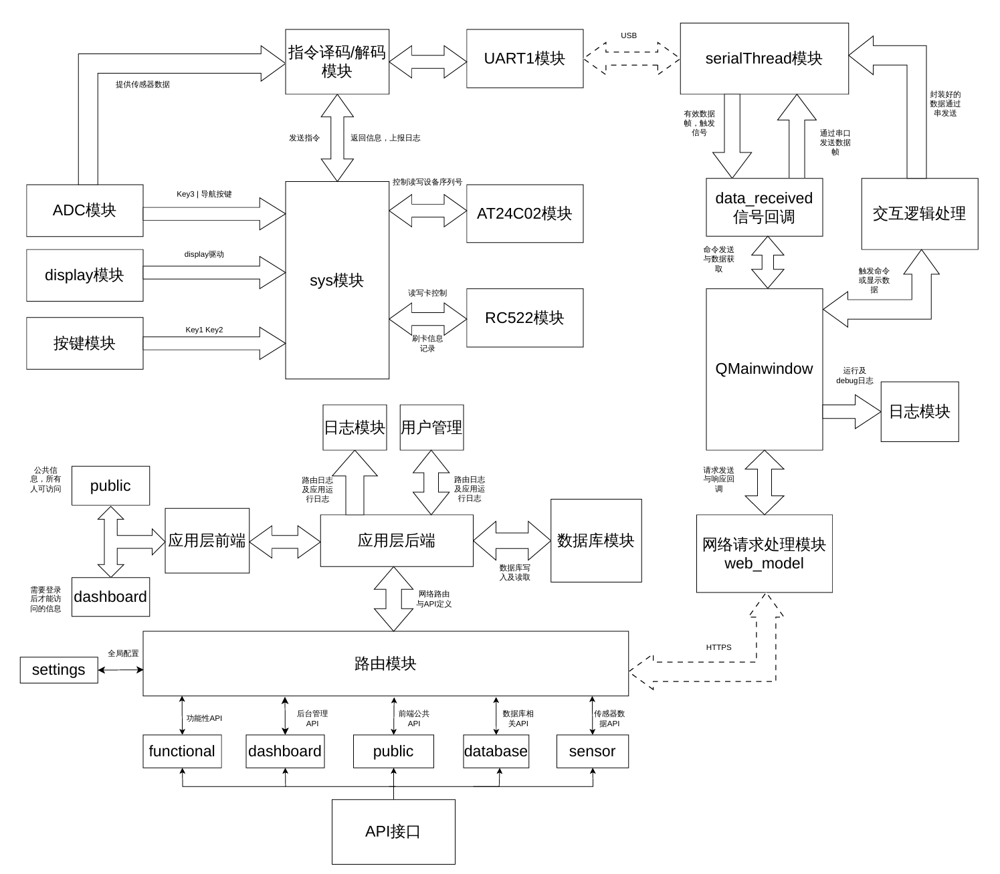

下面将根据架构图，对三层分别进行介绍。

## 1 感知层功能设计

感知层设计如下：


### 1.1 模块

大部分模块在上学期嵌入式实验就已经实现，只做功能介绍。

#### 1.1.1 sys模块

这个模块是整体架构的核心，提供时间，按键，串口接收事件的回调函数绑定方法，可使用的函数及事件包括：

```c
extern void sysInit();
extern void setCallback(char id, userCallback user_callback); // 绑定用户的回调函数
extern void sysRun();

enum event{
	enumEventKey, // 按键按下（key1或key2）
	enumEventInt1, // 定时器0中断1次 -- 这三个中断相关的事件会直接在T0中断里调用
	enumEventInt10, // 定时器0中断10次
	enumEventInt100, // 定时器0中断100次
	enumEventUart1, // 串口1收到合法数据包
	enumEventAdcKey, // adc上的按键按下
	enumEventInt1000, // 中断1000次，1s后
	enumEventUart2 // 串口2收到数据包
};
```

#### 1.1.2 ADC模块

ADC模块实现导航按键以及各个传感器模拟值的获取，实现与上学期相比略作修改，将原本用作ADC值输入的P0和P1引脚取消初始化，防止与RC522模块配置冲突。

可使用函数及变量如下：

```c
typedef struct{
	unsigned int adcP0; // 弃用
	unsigned int adcP1; // 弃用
	unsigned int adcHall;
	unsigned int adcTem;
	unsigned int adcLum; // 注意光照使用int
	unsigned int adcNav;
} ADC;

extern void adcInit();
extern ADC getAdc();
extern unsigned char getADCKeyAct(unsigned char key);

enum adcKey{
	enumADCKey3,
	enumADCKeyRight,
	enumADCKeyDown,
	enumADCKeyCenter,
	enumADCKeyLeft,
	enumADCKeyUp
};
```

由于这一模块是实验中要求的部分，所以对原理做简单介绍。

**ADC初始化：**

初始化需要将P1需要进行ADC的引脚设置为A/D转换功能使用。该设置在`P1ASF`中。然后需要设置ADC控制寄存器`ADC_CONTR`，该寄存器第7位是电源，固定为1；第5，6位是控制速度，这里选最慢的那个；`ADC_FLAG`为ADC转换完成的标志位，该位在ADC转换完成后由硬件置1，并需要软件清0，初始化为0；`ADC_START`为ADC转换开始标志位，需要由软件设置，初始化为1。最低3位选择P1的引脚，控制哪个引脚做数模转换，初始化为000。

另外需要启用ADC的中断，EADC置1，EA=1。

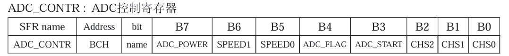

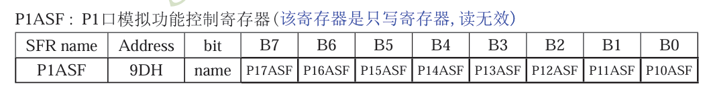

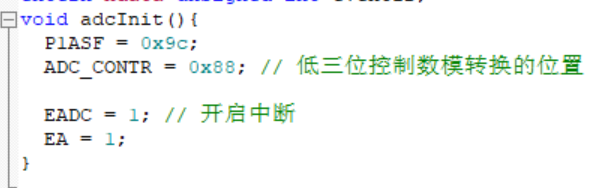

> 在做这里的时候遇到了一个上学期实现的bsp的BUG：我在上学期实现这个初始化的时候，将p1.1和p1.0也设置为了ADC，由于上学期没有用到这两个扩展模块的引脚，所以没有检查出问题。
>
> 这学期在做RC522通信的时候，由于这两个引脚被设置为了ADC，导致RC522那边的数据传输有问题，这个问题卡了我好久。

**adc中断处理：**

adc每次数模转换只能转换一个引脚，如果想要拿到所有引脚的adc的值，需要每次处理完后切换要转换的引脚，这里使用一个计数变量`_adccnt`对adc中断执行次数计数，范围为0-7，每一个表示一个引脚，将他赋值给`ADC_CONTR`的最低三位即可。在中断函数中判断`_adccnt`的值，根据不同的值，将转换值放到`_adc`中即可。这里需要注意`ADRJ`默认为0，表示数模转换的10位中，高8位保存在`ADC_RES`中，低2位保存在`ADC_RESL`中，所以需要将这两个寄存器中的值拼接起来才能得到最终的结果。

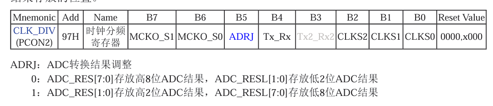

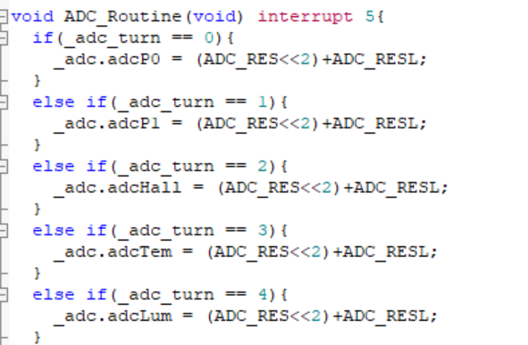

当需要ADC的值时，只需要获取`_adc`即可。此外adc中断还有对于key3以及导航按键的处理，这里不做过多介绍。

> 这种获取传感器数据方式的评价：以现在的视角来审视这部分代码，觉得做的不是很好。ADC数据会在中断中获取，也就是说每次ADC中断都会获取一次传感器数据，但是获取的数据不一定会被上层使用，导致这次ADC被浪费。这对于低功耗要求的嵌入式设备是不好的。更好的做法是，只在上层需要传感器数据，即调用`getAdc`时才尝试去获取传感器，其余的时候不获取，这样可以降低功耗，提高嵌入式设备的寿命。（虽然我们的板子依赖数据线供电，应该不存在这种问题）

#### 1.1.3 RC522模块

RC522模块为实现RFID通信的核心处理模块。这一部分需要深入STC原理图和RC522数据手册，分析各个引脚的作用，并对不同引脚进行控制。具体做法在实验指导书中已经详细进行了介绍，这里只做简单复述。

首先需要定义引脚位置。STC板上的p1.1-p1.0，p4.4-p4.1为扩展接口引脚，且p4.4-p4.1带了反向器，RC522扩展模块分别接入了这几个引脚。

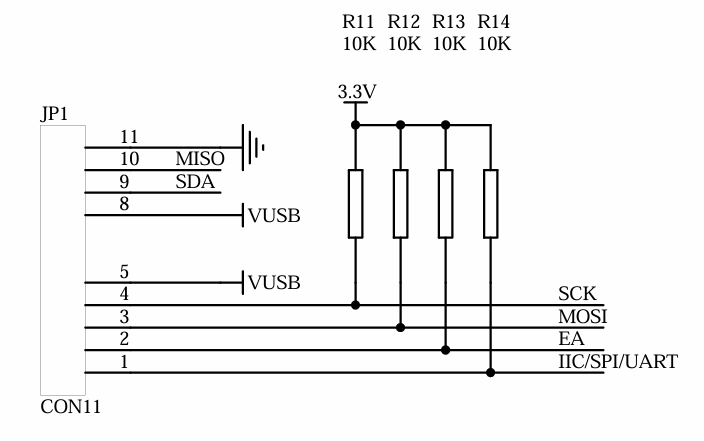

p1.0为数据线，主机输入从机输出，RC522的数据会从这根线传给STC板；SDA在SPI通信中即为NSS，功能类似于读写控制位，低电平有效；SCK是时钟线，在通信中控制时序；MOSI是数据线，主机输出从机输入，用于STC板向RC522发送指令；EA在SPI中固定为1；I2C在SPI中固定为0。

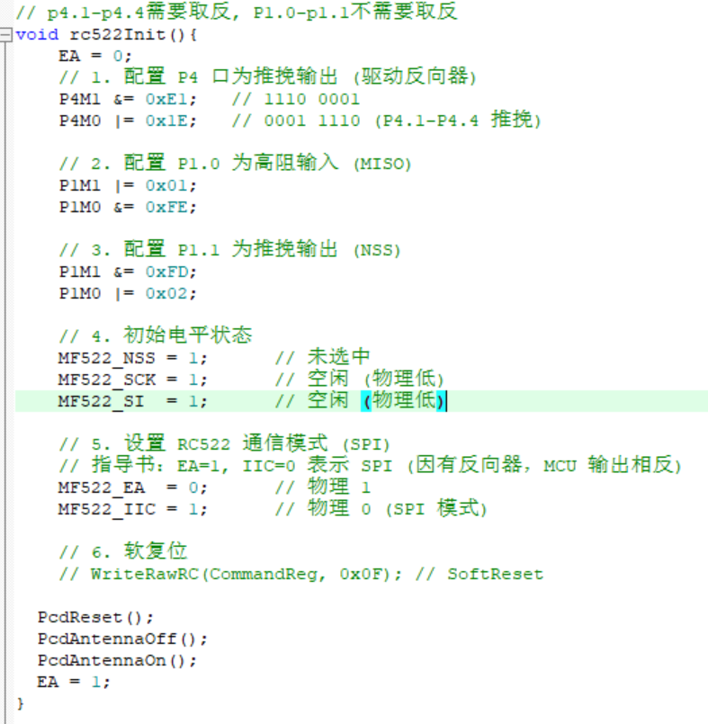

> 注意此处实验指导书中存在一点小错误：指导书中将MF522_SO初始化为了0，这个操作是未定义的行为。主机输入从机输出的引脚，值应该由RC522提供，不应该去给它赋值。前面初始化时也将其作为了高阻输入引脚。
>
> 不过实际测试这个没有任何影响。

对于寻卡等操作的函数，不需要做任何修改，只需要将涉及几个引脚的控制寄存器读写的两个函数进行修改即可，具体做法就是把p4.1-p4.4对应的引脚取反，指导书中已经详细介绍。

---

RFID操作需要进行如下过程：$寻卡 \to 防冲突 \to 选卡 \to 密钥验证 \to 读写卡$。

代码中只需要调用对应的函数即可。例如读卡的函数：

```c
// 正确返回0010 1111 = 0x2f
// 只需要传入_addr，_uid和_buf会保存RFID的uid和读取到的数据
unsigned char readRFID(unsigned char _addr, unsigned char* _uid,unsigned char* _buf){ // 尝试读取uid位于addr的数据
	xdata unsigned char tmp = 0x00, try_cnt = 10;
	while(1){
		if(PcdRequest(0x52, _uid) == 0)tmp |= (1<<0);// 寻卡 S50是0x0400

		if(PcdAnticoll(_uid) == 0)tmp |= (1<<1); // 防冲突，返回uid

		if(PcdSelect(_uid) == 0) tmp |= (1<<2); // 选卡，选择UID对应的卡片

		if(PcdAuthState(0x61, _addr, card_key, _uid) == 0) tmp |= (1<<3);

		// if(PcdWrite(_addr, test_data) == 0) status |= (1<<4);

		if(PcdRead(_addr, _buf) == 0) tmp |= (1<<5);
		
		if(tmp == 0x2f) break;
		else{ // 未成功
			if(try_cnt-- == 0) break; // 尝试10次后，直接返回
			else tmp = 0; // 再次尝试
		}
	}

	
	PcdHalt();
	return tmp;
}
```

返回值定义为RFID操作中的每一步是否成功，（bit4为写成功，bit5为读成功）,只有返回值为`0x2f时表示读取RFID成功`。此外，读取可能会失败，尝试10次后直接退出。其余的函数实现方法类似。

#### 1.1.4 Display模块

显示模块，最常用的，可使用函数：

```c
extern void disInit(); // 初始化
extern void setLed(char led_vector); // led显示
extern void setSeg(char s0, char s1,char s2, char s3,char s4, char s5,char s6, char s7); // 数码管显示
extern void disRun(); // 每次调用显示某一个数码管或者led，也就是说调用9次可以显示所有数码管和led（sysRun中已经调用）
extern void setNum(unsigned long num); // 设置数码管显示一个数字
extern void addPoint(unsigned char cur); // 为某个位置增加小数点
```

#### 1.1.5 按键模块

可以控制Key1和Key2，按下后会触发sys中的事件，可用：

```c
extern unsigned char getKeyAct(unsigned char key); // 判断key是否按下

enum keyName{
	enumKey1,
	enumKey2
};

enum keyAct{
	enumKeyNULL,
	enumKeyPress
};
```

#### 1.1.6 AT24C02模块

用于读写AT24C02芯片中的256个字节：

```c
extern void ATInit(); // 初始化
extern unsigned char rAT(unsigned char addr); // 读取addr的数据
extern void wAT(unsigned char addr, unsigned char val); // 写入数据
```

在代码实现中，该模块用于保存分配给设备的序列号，具体保存在地址`0x50-0x55`，这是自注册功能设计（6.1）的一部分。

#### 1.1.7 指令译码/解码模块

这个模块依赖sys中的enumEventUart1事件，当上位机发来指令后，uart1收到数据帧，会触发sys的串口1事件，进入串口1回调函数，该模块在回调函数中对封装的数据帧进行偶校验判断，指令解码，根据不同的指令，执行不同操作。

该模块还需要将需要返回给上位机的数据封装为数据帧，具体封装方式参照`感知层-网络层通信协议`，调用串口模块将数据发送出去。

#### 1.1.8 UART1模块

该串口模块设计较为简陋（早期的设计，但是一直没有改），接收等长的数据包，可以设置数据保存的位置，以及数据包头。

```c
extern void uart1Init(unsigned long baudrate);
extern void uart1Send(unsigned char* content, unsigned char num); // 发送的数据，指针和大小
extern void setUart1Buf(unsigned char* buf, unsigned char buf_num, unsigned char* head, unsigned char head_num); // 设置接收到数据后保存的位置和包头
```

### 1.2 功能

这一层的主要任务是获取传感器数据，以及外接RC522实现读写卡，本体设计较为简单，难点在于设计读写卡的时序并完成一系列相关操作。程序分为三个模式：

1. mode0：待机模式
2. mode1：检测模式
3. mode2：设置模式

下面分开介绍三种模式。

#### 1.2.1 MODE0 待机模式

该模式为上电后进入的状态，此时设备会对网络层的命令进行响应，自身不会主动进行任何操作，可以用来测试程序正确性。包含如下交互功能：

- key1 - 读取当前RFID的序列号，通过串口输出
- key2 - 切换下一个模式
- key3 - 读取当前RFID的序列号以及位于地址20的16字节数据，通过串口返回，共20字节
- 收到应用层数据包：根据协议做出响应

数码管显示为当前设备的序列号，led显示表示当前显示的是哪三个字节，L0-L2代表低三个字节，L3-L5代表高三个字节。

- 通过NavUp/NavDown切换当前显示
- 按下NavCenter会将设备序列号重置为全0，这个操作可以配合网络层和应用层的自注册功能实现设备序列号更新

#### 1.2.2 MODE1 检测模式

该模式下系统进入检测RFID的状态，每隔1S检测一次RFID，如果检测到RFID，流水灯并在数码管上显示RFID的uid，此时可以与RFID进行通信。

该模式每隔30s会向网络层上报一次传感器数据。

#### 1.2.3 MODE2 设置模式

该模式可以用于设置扣款金额，然后结合刷卡功能，刷卡后扣除对应的金额。

## 2 感知层-网络层通信协议

**指令字节：**

- 00 - 获取RFID的uid
- 01 - 获取某个地址的数据（RFID）
- 02 - 写入某个地址的数据（RFID）
- 03 - 获取传感器数据
- 04 - 向从机写入其序列号
- 05 - 获取从机序列号
- 06 - 提交RFID刷卡信息
- 07 - 提交扣款请求
- FF - DEBUG指令

### 2.1 $感知层 \to 网络层$:

使用不等长编码，通常的数据帧格式为：

**数据包头AA55+字节数+指令字节+数据包+偶校验**

> 偶校验包含数据包头和字节数，字节数指除包头和字节数的部分（指令字节+数据包+偶校验）

#### 00 获取uid

收到获取uid信息后，底层调用PcdRequest函数，并尝试获取uid，获取到后编码返回：
`aa 55 06 00 d1 d2 d3 d4 xx`
其中6为数据包字节数，00为指令字节，xx为偶校验

#### 01 获取某个地址的数据

单片机需要获取到数据后返回：
`aa 55 13 01 addr d1-d16 xx`
0x13为数据包字节数，包含指令字节1+读取地址1+数据字节16+偶校验1

#### 02 写入某个地址数据

单片机需要根据提供的地址，将数据写入，返回状态信息：
`aa 55 xx 02 sig d1-d16 xx`
这条指令分两种情况：

- 写入成功时，返回19个字节，包含指令字节1+返回状态1+数据16+偶校验
  此时字节数为19=0x13，返回状态为非0值，原样返回16字节数据，以及偶校验
  返回数据帧格式：`aa 55 13 02 01 d1-d16 xx`
- 写入失败时，返回3个字节，包含指令字节1+返回状态1+偶校验1
  返回状态为0,表示失败
  返回数据帧格式：`aa 55 03 02 00 xx`

#### 03 获取传感器数据

传感器数据包括：温度，光照，霍尔，振动

单片机受到获取传感器数据的指令时，需要将传感器数据封装返回：
`aa 55 08 03 t1 t0 i1 i0 hall shake xx`
t1,t0为温度值，i1,i0为光照，hall为霍尔，shake为振动

#### 04 写入从机序列号

这条指令用于向从机的**AT24C02芯片**写入一段序列号（6字节），用于唯一标识从机。

保存的地址：0x50-0x0x55，大端保存

- 写入成功后，返回：
  `aa 55 08 04 d1-d6 xx`
  包头2+字节数1+指令1+序列号6+偶校验1
- 写入失败，返回：
  `aa 55 03 04 00 xx`
  包头2+字节数1+指令1+零字节1+偶校验1

#### 05 获取从机序列号

这条指令用于从从机的地址0x50-0x55获取序列号并返回。

收到获取序列号的数据帧后，返回：

`aa 55 08 05 d1-d6 xx`

包头2+字节数1+指令1+序列号6+偶校验1

#### 06 提交RFID刷卡信息

这条指令用于从机向主机提交刷卡的相关信息。

数据帧格式：

`aa 55 06 06 d1-d4 xx`

包头2+字节数1+指令1+RFID序列号4+偶校验1

#### 07 提交扣款请求

这条指令用于向服务器发送扣款请求，包含一个RFID卡号和扣款金额。网络层收到这条指令后会向应用层传输该请求，具体参照第6章中的相关介绍。

金额以大端法传输。

数据帧格式：

`aa 55 08 07 d1-d4 v1-v2 xx`

包头2+字节数1+指令1+RFID序列号4+金额2+偶校验1

#### FF DEBUG指令

主机操作，仅$感知层 \to 网络层$**单向指令**，网络层不返回任何信息

1. 单字节指令固定为6个字节，包头2（AA55）+字节数1（3）+命令字节1（FF）+DEBUG值1+校验码1
   `aa 55 03 FF xx chk_sum`，DEBUG值任意，校验码依然为偶校验

2. 多字节指令，字节数可以任意，但是要满足字节数和偶校验匹配
   `aa 55 num FF xx ... xx chk_sum`，`num`为字节数，`xx`为DEBUG数据，`chk_sum`为偶校验

### 2.2 $网络层 \to 感知层$:

> 连接层GUI在输入内容时需要遵循如下规则：
>
> 1. 所有数据以16进制数字显示，每个字节之间以Space分割
> 2. 写入数据时，第一个字节为地址，后16个字节为数据

连接层到感知层为等长编码，所有数据包固定为24字节，起始两字节固定为AA55，最后一字节固定为偶校验，中间的字节传输指令，不足用00补齐。

一条数据的格式包括：

**数据包头+指令字节+数据+偶校验**

指令字节同前述。

#### 00 获取uid

此时主机需要发送获取uid的指令：
`aa 55 00 00 00 ... 00 00 xx`
第二字节的00为指令，最后的xx为偶校验，其余00为补齐字节
包头2+指令1+补齐20+偶校验1

#### 01 获取某个地址的数据

`aa 55 01 addr 00 00 ... 00 00 xx`
01为指令字节，addr为要获取的地址（0-63）
包头2+指令1+地址1+补齐19+偶校验1

#### 02 写入某个地址的数据

`aa 55 02 addr d1-d16 00 00 00 xx`
数据包长24字节，包头2+指令1+地址1+数据16+补齐3+偶校验1

#### 03 获取传感器数据

连接层需要发送获取传感器数据的指令：
`aa 55 03 00 ... 00 xx`

包头2+指令1+补齐20+偶校验1

#### 04 写入从机序列号

这条指令网络层需要传输从机序列号：

`aa 55 04 d1-d6 00 ... 00 xx`

包头2+指令1+序列号6+补齐14+偶校验1

#### 05 获取从机序列号

网络层发送获取从机序列号的数据帧：

`aa 55 05 00 ... 00 xx`

包头2+指令1+补齐20+偶校验1

#### 06 提交RFID刷卡信息

网络层需要将刷卡信息上报到应用层，等待应用层响应后，把成功信息返回给感知层，数据帧格式：

`aa 55 06 01 ... xx`

包头2+指令1+状态1+补齐19+偶校验1

状态字节为1表示成功，为0表示失败

#### 07 提交扣款请求

在网络层，这条信息是应用层传输回成功信息后，向感知层发送成功信息的。数据帧格式：

`aa 55 07 01 ... xx`

包头2+指令1+状态1+补齐19+偶校验1

## 3 网络层功能设计

网络层功能如下：

- 感知层串口控制
- 向感知层发送命令并接收信息
- 向应用层上报信息

网络层功能概图如下：


### 3.1 程序结构

项目目录如下：

```bash
├── log
│   └── app.log
├── main.py
├── model
│   ├── __init__.py
│   ├── serialThread.py
│   └── web_model.py
├── pyproject.toml
├── README.md
├── scripts
│   ├── checksum.py
│   └── tmp.py
├── test.ui
└── uv.lock
```

- log为运行日志
- main.py为程序主文件，包含主窗口定义，UI加载，交互逻辑实现，子模块控制等。
- model保存自定义的模块设计，主要是串口模块与网络请求控制模块
- scripts保存临时测试的脚本文件
- test.ui为GUI设计文件

### 3.2 感知层控制

这部分主要依赖`serialThread`与感知层串口进行通信。

- 当用户点击交互按钮后，会出发交互按键绑定的handler，然后分析交互事件并进行正确的数据帧封装，通过串口发送命令

- 当感知层返回数据时，首先在`serialThread`进行数据帧合法性检验，不符合通信协议的数据帧会被直接抛弃，符合通信协议的数据帧会通过`data_received`信号发送给`QMainWondow`并触发信号回调函数，该函数中对数据帧进行解封装处理，并将受到的数据更新到UI界面。

可进行的操作：

- 获取RFID的UID
- 获取RFID某个地址的数据
- 向RFID某个地址写入数据
- 获取传感器数据

设备序列号的管理：

- 每个设备都有一个独立的设备序列号用于唯一标识这个设备，序列号为6个字节，保存在感知层AT24C02芯片的地址0x50-0x55。

- 网络层可以控制设别的序列号（读/写）
- 每次连接新的设备时，自动获取其序列号，如果检测到设备无序列号，则向上层汇报，应用层会分配一个新的序列号传回。网络层获取到新的序列号后，更新感知层的序列号。

> 由于自注册功能改版，网络层的序列号控制更改为前述的设计，下面是第一版的设计，已经弃用。
>
> - 网络层可以控制连接设备的序列号（读/写），应用层可以自发将新的设备加入数据库。
> - 网络层需要控制设备序列号，具体操作为：
>   - 当感知层传入非全0的序列号，正常上报数据
>   - 当感知层传入全0的序列号，此时不上报数据，先向应用层申请设备列表，然后分配一个不冲突的设备序列号给当前设备，感知层收到这个设备序列号后更新自己的序列号并重发数据。

### 3.3 应用层控制

应用层的通信主要是网络层上报传感器数据，需要提供如下信息：

- 感知层上报的传感器信息（包含温度，光照，霍尔以及时间戳）

此外还有自注册功能需要的：

- 请求设备列表（第一版，弃用，但接口保留）
- 请求分配序列号（第二版）

> 其中时间戳无法在感知层一侧精确获取（DS1302存在较大误差），所以时间戳从网络层获取，存在传输的一点误差。

### 3.4 网络请求模块

#### 3.4.1 webModel模块

该模块负责与应用层的网络通信，内部创建一个webThread。目前支持三个通信的功能：

- 上报传感器数据（submit_sensor_data）
- 获取设备列表（get_device_list）
- 提交刷卡记录（submit_card_swipe）

> 具体API使用方式参考`应用层功能设计`的routes模块

由于网络请求是异步的，所以请求会提交给webThread处理。

当请求得到响应后，webThread会将响应题按照如下形式封装，并通过信号`resp_signal`提交给webModel，webModel可以在函数`resp_parse`中进行处理（比如继续向SerialToolWindow发送信号）

几个功能实现逻辑相同，即封装请求信息，将请求加入到子线程的请求队列中，例如提交传感器的函数：

```python
def submit_sensor_data(self, device_seq: bytes, temp: float, light: int, hall: int):
    """提交传感器数据"""
    url = f"{self.par.base_url}/api/submit_sensor_data"

    data = {
        "device_seq": device_seq.hex(),
        "temperature": temp,
        "light": light,
        "hall": hall,
        "timestamp": str(time.time()),
    }
```

子线程获取到响应后，会从信号槽返回响应

响应返回格式：

```python
data = {
    "status": resp.status_code, # 返回的状态码
    "url": resp.url, # 请求的url
    "resp": resp.text # 返回的响应内容
}
```

这个格式的数据会继续传送到主线程，交由主线程的相关函数处理。

#### 3.4.2 webThread模块

该模块为webModel的子模块，用于发送webModel需要的请求。内部维护两个资源：会话session和请求队列`requests_queue`。

当请求传来时，该请求会被放入请求队列；线程主循环会不断从队列中获取请求，当获取到请求后向目标服务器发送该请求，得到相应后通过信号槽`resp_signal`将响应返回。

提供的功能主要是两个：

- **添加待执行请求**
- **执行请求**

添加请求：把请求加入队列

```python
def add_request(self, url: str, method: str, data: dict = None):
    if not self.requests_queue.full():
        self.requests_queue.put((url, method, data))
    else:
        self.par.par.log.warning(f"运行函数[add_request]错误：请求队列已满，新增请求失败：{(url, method, data)}")
```

执行请求：从队列中取出一条请求执行

```python
def _do_requests(self, url: str, method: str, data: dict | None):
    """执行请求的函数"""
    method = method.upper()
    try:
        if method == "GET":
            resp = self.session.get(url, timeout=REQUESTS_TIMEOUT)
            data = {
                "status": resp.status_code,
                "url": resp.url,
                "resp": resp.text
            }
            self.resp_signal.emit(data)
        elif method == "POST":
            resp = self.session.post(url, json=data, timeout=REQUESTS_TIMEOUT)
            data = {
                "status": resp.status_code,
                "url": resp.url,
                "resp": resp.text
            }
            self.resp_signal.emit(data)
    except Exception as e:
        self.par.par.log.error(f"运行函数[_do_requests]错误：{e}")
```

线程运行函数：轮询请求队列，有请求则取出执行

```python
def run(self):
    while self._is_running.is_set():
        try:
            url, method, data = self.requests_queue.get(timeout=QUEUE_TIMEOUT)
            self._do_requests(url, method, data)
        except:
            continue
```

### 3.5 serialThread模块

该模块管理与串口通信相关的部分。

包含串口的开关，串口数据的发送和接收。

串口打开后，串口线程会不断从串口获取数据，当获取到符合通信协议的数据帧时，通过`data_receive`信号将数据交给MainWindow中的回调函数处理。

#### 3.5.1 打开串口

```python
def open_serial(self, port: str = "COM5", baudrate: int = 9600, timeout: float = 1.0):
    try:
        self.serial.port = port
        self.serial.baudrate = baudrate
        self.timeout = timeout
        self.serial.open()
        self.par.log.info(f"串口打开成功！(port: {port} baudrate: {baudrate} timeout: {timeout:.1f})")
    except Exception as e:
        self.par.log.error(f"串口打开失败:{e}")
```

#### 3.5.2 关闭串口

```python
def close_serial(self):
    if self.serial and self.serial.is_open:
        self.serial.close()
        self.par.log.info("串口关闭成功！")
    else:
        self.par.log.warning("串口已关闭！")
```

#### 3.5.3 发送数据

```python
def send_data(self, data: bytes):
    if self.serial and self.serial.is_open:
        self.serial.write(data)
        self.par.log.debug(f"数据发送成功：{self._to_hex_stream(data)}")
    else:
        self.par.log.warning(f"串口未打开，数据发送失败：{self._to_hex_stream(data)}")
```

#### 3.5.4 线程主循环/数据接收

接收数据包时，需要根据前文定义的`2 感知层-网络层通信协议`，感知层到网络层是不等长数据帧，首先检测包头`AA 55`，然后获取要读取的数据字节数，之后读取数据，进行偶校验检验，合法将数据帧发送给主线程处理。

(下面的代码是精简版本，以实际代码为准)

```python
def run(self):
    head = [0xaa, 0x55] # 数据包头
    data = b""
    while self.is_running.is_set():
        if self.serial and self.serial.is_open:
              data = self.serial.read(2)
              if data and data[0] == head[0] and data[1] == head[1]:
                  num = self.serial.read(1)
                  if num:
                      num = int.from_bytes(num, "big")
                  else:
                      continue
                  content = self.serial.read(num) # 读取实际的数据和校验位
                  content = data+num.to_bytes(1, "big")+content
                  if(self._check_sum(content)):
                      self.par.log.info(f"收到合法数据包：{content.hex()}")
                      self.data_received.emit(content)
                  else:
                      self.par.log.warning(f"收到数据包，但是未通过偶校验：{content.hex()}, 偶校验结果：{self._check_sum(content)}")
              else:
                  continue
        else:
            self.msleep(100)
        data = b"" # 处理完一次清空缓冲区
```

## 4 网络层-应用层通信协议

网络层与应用层的通信经过`HTTP协议`进行，包含下面几个部分：

1. 应用层API设计中，与网络层通信的部分
2. 网络层API调用封装为交互界面
3. 网络层自动获取感知层数据并调用API向应用层发送

具体的API使用方法参考`5.4 后端API使用`部分。

## 5 应用层功能设计

应用层设计如下：

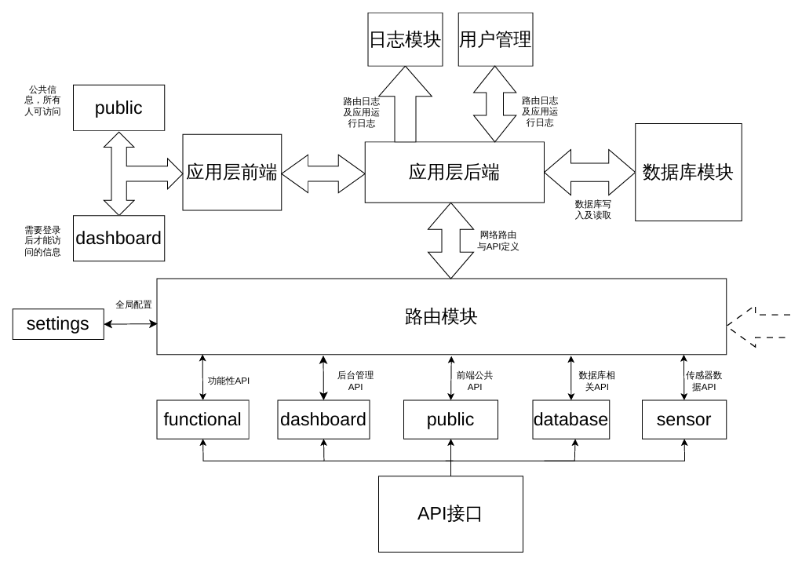

该图以接口类型为主，省去了前端的具体实现细节。后端的实现中，包含以下面的几个子模块：

- 管理数据库的模块dbObject
- 路由相关的模块
- 管理日志的模块myLogger

### 5.1 数据库模块（dbObject）

该模块包含功能较多，主要包含：传感器数据管理，设备信息管理，用户管理，刷卡记录管理等。

数据库维护一个设备列表，这个设备列表包含所有已经被捕获的设备序列号以及捕获时间。

对于每个已知的设备，会单独维护一个该设备的数据表，包含它上报的所有传感器数据。

> 该模块是支持分布式的，对于一个新的设备到来，只要保证它的设备序列号和已有的设备序列号不冲突，就可以自动将其加入已知设备列表，并存储它的数据。
>

此外还有两个独立的表，用于保存用户数据和RFID的刷卡记录。

数据库模块代码较多，因此不在设计文档中展现，具体可参考实际代码设计，此处仅介绍实现思路。数据库整体使用python的sqlite3实现，不使用mysql主要是因为数据库连接较为麻烦，考虑到后续服务器部署等操作，使用更轻量的sqlite做有效性验证。如果部署实际场景，将这个模块替换为mysql版本可能更好。

#### 5.1.1 初始化

初始化的主要任务是检查当前数据库中是否存在需要的表：数据表，设备表，用户表，刷卡记录表，金额表

- 初始化时需要检查当前数据库中是否包含设备表，如果没有则创建设备表。
- 如果存在已有设备表，检查每个设备是否存在自己的数据表，如果没有则创建。
- 检查用户表，如不存在则创建表（root用户在`utils.root_manage`中保证存在，此处只保证用户表存在）
- 检查记录表，如不存在则创建
- 检查金额表，如不存在则创建

#### 5.1.2 数据表

**添加数据**

这个函数是实现数据持久化的以及网络自注册的核心功能，具体如下：

1. 当调用这个函数时，检查传入数据的来源（设备序列号）
2. 如果序列号包含在设备表中并且存在数据表，则直接将数据加入到数据表中
3. 如果序列号不包含在设备表中，则先将设备加入设备表中，然后创建设备的数据表，并将数据加入数据表

返回值：

- 成功：`True`

- 失败：`False`

**获取数据**

从数据表中获取数据并返回。

返回值：

- 成功：`[dict(sensor_data) for row in read_data]`
- 失败：`[]`

**删除数据**

从某个数据表中删除某条数据

返回值：

- 成功：`{"status": "success", "message": "删除成功"}`

- 失败：

  ```python
  {"status": "error", "message": "缺少 device_seq 参数"}
  {"status": "error", "message": "无效的ID"}
  {"status": "not_found", "message": f"ID为{id}的数据不存在"}
  {"status": "error", "message": str(e)}
  ```

#### 5.1.3 设备表

**获取设备列表**

从设备表中获取所有设备信息并返回一个列表

返回值：

- 成功：`[device_list]`
- 失败：`[]`

**添加设备**

虽然系统设计是自注册的，但是仍然提供手动添加和删除设备的功能。

首先检查设备表中是否已经存在该设备，如果存在返回设备已存在信息；如果不存在则将设备加入设备表，然后创建设备的数据表。

返回值：

- 成功：`{"status": "success", "message": "添加成功"}`

- 失败：

  ```pyhton
  {"status": "error", "message": "缺少设备序列号参数"}
  {"status": "exist", "message": f"设备 {seq} 已存在"}
  {"status": "error", "message": str(e)}
  ```

**删除设备**

检查设备是否存在，如果不存在返回设备未找到信息；如果存在删除设备的数据表，并从设备表中将该设备删除。

返回值：

- 成功：`{"status": "success", "message": "delete success"}`

- 失败：

  ```python
  {"status": "error", "message": "缺少设备序列号参数"}
  {"status": "not_found", "message": f"设备 {seq} 不存在"}
  {"status": "error", "message": str(e)}
  ```

#### 5.1.4 用户表

**初始化**

用户表为框架建立后新加部分，因此相对独立，初始化函数单独编写后在dbObject的`__init__`中调用。

> 出于代码统一性以及简洁易读，已经删去了独立函数，统一在`__init__`中实现。

检查是否存在用户表，如果不存在则创建，表项如下：

```sqlite
CREATE TABLE IF NOT EXISTS auth(
    id INTEGER PRIMARY KEY AUTOINCREMENT,
    username TEXT UNIQUE NOT NULL,
    password_hash TEXT NOT NULL,
   	timestamp TEXT NOT NULL
)
```

**添加用户**

将一个用户添加进用户表中，记录当前的时间戳，将密码进行sha256哈希后一并保存进表中。

返回值：

- 成功：`{"status": "success", "message": "添加成功"}`

- 失败：

  ```python
  {"status": "error", "message": "缺少用户名参数"}
  {"status": "error", "message": "缺少密码参数"}
  {"status": "exist", "message": f"用户 {username} 已存在"}
  {"status": "error", "message": str(e)}
  ```

**删除用户**

从表中查找目标用户，如果存在则删除

返回值：

- 成功：`{"status": "success", "message": "删除成功"}`

- 失败：

  ```python
  {"status": "error", "message": "缺少用户名参数"}
  {"status": "not_found", "message": f"用户 {username} 不存在"}
  {"status": "error", "message": str(e)}
  ```

**获取用户密码哈希值**

从表中查找用户，存在则返回其密码的哈希值

返回值：

- 成功：`{"status": "success", "password_hash": password_hash}`

- 失败：

  ```python
  {"status": "error", "message": "缺少用户名参数"}
  {"status": "not_found", "message": f"用户 {username} 不存在"}
  {"status": "success", "password_hash": password_hash}
  {"status": "error", "message": str(e)}
  ```

**获取用户表**

获取所有用户的信息

返回值：

- 成功：`{"status": "success", "users": users}`

- 失败：

  ```python
  {"status": "error", "message": str(e)}
  ```

**更新用户密码**

传入明文密码后进行sha256哈希并更新用户的密码

返回值：

- 成功：`{"status": "success", "message": "更新成功"}`

- 失败：

  ```python
  {"status": "error", "message": "缺少用户名参数"}
  {"status": "error", "message": "缺少新密码参数"}
  {"status": "not_found", "message": f"用户 {username} 不存在"}
  {"status": "error", "message": str(e)}
  ```

#### 5.1.5 记录表

记录表每个表项包含四条信息：`(id, 设备序列号, RFID序列号, 时间戳)`

> 该功能简单设计了，不实现增删改查所有功能了，只有增查

检查是否存在记录表，如果不存在则创建，表项如下：

```sqlite
CREATE TABLE IF NOT EXISTS card_swipes(
    id INTEGER PRIMARY KEY AUTOINCREMENT,
    device_seq TEXT,
    rfid_serial TEXT,
    timestamp TEXT
)
```

**添加刷卡记录**（insert_card_swipe）

将一条刷卡记录添加进记录表中。

返回值：

- 成功：`{"status": "success", "message": "插入成功"}`

- 失败：

  ```python
  {"status": "error", "message": "缺少设备序列号参数"}
  {"status": "error", "message": "缺少RFID序列号参数"}
  {"status": "error", "message": str(e)}
  ```

**获取刷卡记录**（get_card_swipes）

从记录表中获取刷卡记录，支持按设备序列号筛选。

返回值：

- 成功：`{"status": "success", "swipes": swipes}`

  其中 swipes 为列表，每个元素包含 `id, device_seq, rfid_serial, timestamp`

- 失败：

  ```python
  {"status": "error", "message": str(e)}
  ```

#### 5.1.6 金额表

金额表保存RFID的剩余金额，每条表项包含信息：`(id, uid, balance, created_at, updated_at)`

uid为RFID的uid，balance为剩余金额，created_at为创建时间，updated_at为最后一次更新的时间

初始化时检查是否存在金额表，如不存在则创建：

```sqlite
CREATE TABLE IF NOT EXISTS rfid_cards(
    id INTEGER PRIMARY KEY AUTOINCREMENT,
    uid TEXT UNIQUE NOT NULL,
    balance REAL NOT NULL DEFAULT 0,
    created_at TEXT NOT NULL,
    updated_at TEXT NOT NULL
)
```

对于该表有以下的操作：

**获取RFID卡列表**（get_rfid_cards）

获取从`start`开始共`num`条RFID卡信息，按ID倒序排列。

- 成功：`{"status": "success", "cards": [...]}`，cards为列表，每个元素包含 `id, uid, balance, created_at, updated_at`
- 失败：`{"status": "error", "message": str(e)}`

**获取单个RFID卡**（get_rfid_card）

根据uid获取单张RFID卡的信息。

- 成功：`{"status": "success", "card": {...}}`
- 失败：
  ```python
  {"status": "error", "message": "UID不能为空"}
  {"status": "not_found", "message": f"RFID卡 {uid} 不存在"}
  {"status": "error", "message": str(e)}
  ```

**添加RFID卡**（add_rfid_card）

将一张新的RFID卡添加到金额表中，指定初始余额（默认0）。

- 成功：`{"status": "success", "message": "添加成功"}`
- 失败：
  ```python
  {"status": "error", "message": "UID不能为空"}
  {"status": "error", "message": str(e)}
  ```

**修改RFID卡余额**（update_rfid_card_balance）

修改指定RFID卡的余额，支持两种模式：

- `mode="add"`：在现有余额基础上增减（amount为正数增加，负数扣除）
- `mode="set"`：直接将余额设为amount的绝对值

当卡不存在时，`add`模式会自动创建该卡并设置余额为amount；`set`模式则返回不存在错误。

- 成功（卡存在）：`{"status": "success", "message": "余额更新成功", "balance": new_balance}`
- 成功（卡不存在，自动创建）：`{"status": "success", "message": "卡不存在，已自动创建", "balance": new_balance}`
- 失败：
  ```python
  {"status": "error", "message": "UID不能为空"}
  {"status": "not_found", "message": f"RFID卡 {uid} 不存在"}
  {"status": "error", "message": f"无效的操作模式: {mode}"}
  {"status": "error", "message": str(e)}
  ```

**删除RFID卡**（delete_rfid_card）

根据uid删除一张RFID卡。

- 成功：`{"status": "success", "message": "删除成功"}`
- 失败：
  ```python
  {"status": "error", "message": "UID不能为空"}
  {"status": "not_found", "message": f"RFID卡 {uid} 不存在"}
  {"status": "error", "message": str(e)}
  ```

**确保RFID卡存在**（ensure_rfid_card）

检查指定uid的卡是否存在，若不存在则自动创建（余额为0）。该方法用于刷卡记录提交时自动注册未知卡，类似于设备自注册的设计。

- 成功（已存在）：`{"status": "success", "card": {...}}`
- 成功（自动创建）：`{"status": "success", "card": {...}}`
- 失败：
  ```python
  {"status": "error", "message": "UID不能为空"}
  {"status": "error", "message": str(e)}
  ```
### 5.2 路由模块（routes）

该模块包含下面几个子部分：

- 传感器相关路由（sensor）
- 数据库操作相关路由（database）
- 其他路由（functional）

#### 5.2.1 sensor

包含路由：

```python
sensor_route = Blueprint("sensor", __name__, url_prefix="/api")
@sensor_route.route("/submit_sensor_data", methods=["POST"])
@sensor_route.route("/remove_sensor_data", methods=["POST"])
@sensor_route.route("/fetch_sensor_data", methods=["POST"])
```

三个功能实现的过程类似，即：

1. 从请求中提取参数
2. 调用dbOdject中相关的函数对数据库操作
3. 封装返回响应体并返回

例如移除传感器数据的路由：

```python
"""移除传感器数据"""
@sensor_route.route("/remove_sensor_data", methods=["POST"])
def remove_sensor_data_handler():
    data = request.get_json()

    status = db.remove_sensor_data(data.get("id"), data.get("device_seq"))

    data["rcv_status"] = status.get("status")
    data["rcv_time"] = str(time.time())
    return make_response(jsonify(data), 200 if data["rcv_status"] == "success" else 400)
```

#### 5.2.2 database

包含路由：

```python
database_bp = Blueprint("database", __file__, url_prefix="/api")
@database_bp.route("/get_device_list", methods=["GET", "POST"])
@database_bp.route("/add_device", methods=["POST"])
@database_bp.route("/remove_device", methods=["POST"])
```

例如获取设备列表的路由，思路与前述`sensor`类似：

```python
"""获取设备列表"""
@database_bp.route("/get_device_list", methods=["GET", "POST"])
def get_device_list_handler():
    device_list = db.get_device_list()
    return make_response(jsonify(device_list), 200)
```

#### 5.2.3 functional

包含路由：

```python
functional_routes = Blueprint("functional", __name__, url_prefix="/api")
@functional_routes.route("/distribute_seq", methods=["POST"])
```

分配设备序列号的路由：

1. 从数据库中获取设备列表
2. 生成一个不冲突的序列号
3. 封装响应体并返回

> 由于只是生成一个随机6字节数，所以实际实现直接在路由模块中，没有单独开线程。

```python
def generate_device_seq(existing_devices: list) -> str:
    """生成不与现有设备冲突的12位十六进制序列号"""
    max_attempts = 100
    for _ in range(max_attempts):
        new_seq = secrets.token_hex(6)  # 生成12位十六进制字符串
        if new_seq not in existing_devices:
            return new_seq
    raise Exception("无法生成唯一的设备序列号，请稍后重试")

@functional_routes.route("/distribute_seq", methods=["POST"])
def distribute_seq_handler():
    device_list = db.get_device_list()
    try:
        new_seq = generate_device_seq(device_list)
        rsp = {
            "device_seq": new_seq,
            "status": "ok",
            "timestamp": str(time.time())
        }
        return make_response(jsonify(rsp), 200)
    except Exception as e:
        rsp = {
            "status": "error",
            "message": str(e),
            "timestamp": str(time.time())
        }
        return make_response(jsonify(rsp), 500)
```

#### 5.2.4 public

包含路由：

```python
public_routes = Blueprint("public", __name__, url_prefix="/public")
@public_routes.route("/")
```

返回public的前端HTML。

#### 5.2.5 admin

包含路由：

```python
admin_bp = Blueprint("admin", __name__, url_prefix="/admin")
@admin_bp.route("/")
@admin_bp.route("/login", methods=["POST"])
@admin_bp.route("/logout", methods=["POST"])
```

处理与用户状态有关的路由。包含三个内容：

- 返回admin前端
- 登入请求
- 登出请求

对于登入请求，从数据库中获取用户密码的hash值，如果hash匹配则认证通过，将username保存在session中，作为cookie信息与用户保持会话。后续所有与dashboard有关的请求均会要求session的username字段。

```python
@admin_bp.route("/login", methods=["POST"])
def admin_login_handler():
    """Handle login - validate credentials, set session, redirect to /dashboard"""
    data = request.get_json() or {}
    username = data.get("username", "").strip()
    password = data.get("password", "")

    if not username or not password:
        return make_response(jsonify({"status": "error", "message": "Missing username or password"}), 400)

    result = db.get_auth_pwd(username)
    if result["status"] != "success":
        return make_response(jsonify({"status": "error", "message": "Invalid credentials"}), 401)

    password_hash = hashlib.sha256(password.encode()).hexdigest()
    if password_hash != result["password_hash"]:
        return make_response(jsonify({"status": "error", "message": "Invalid credentials"}), 401)

    session["username"] = username
    return make_response(jsonify({"status": "success", "message": "Login successful", "redirect": "/dashboard"}), 200)
```

对于登出请求，直接移出session的username字段即可。

```python
@admin_bp.route("/logout", methods=["POST"])
def admin_logout_handler():
    """Handle logout - clear session, return JSON response"""
    session.pop("username", None)
    return make_response(jsonify({"status": "success"}), 200)
```

> 该模块早期存在BUG: 返回的是redirect重定向到/admin,但是这个重定向实际在前端执行了，所以会导致前端处理错误。这里需要返回登出success,然后交由前端重定向到/admin

#### 5.2.6 dashboard

包含路由：

```python
dashboard_routes = Blueprint("dashboard", __name__, url_prefix="/dashboard")
@dashboard_routes.route("/")
@dashboard_routes.route("/check", methods=["GET"])

# 子路由analysis_bp
@analysis_bp.route("/fetch_analysis_data", methods=["POST"])

# 子路由user_management_bp
@user_management_bp.route("/check_root", methods=["GET"])
@user_management_bp.route("/get_all_users", methods=["GET"])
@user_management_bp.route("/add_user", methods=["POST"])
@user_management_bp.route("/update_user", methods=["POST"])
@user_management_bp.route("/delete_user", methods=["POST"])

# 子路由card_swipe_bp
card_swipe_bp = Blueprint("card_swipe", __name__, url_prefix="/card_swipe")
@card_swipe_bp.route("/submit_card_swipe", methods=["POST"])
@card_swipe_bp.route("/fetch_card_swipe", methods=["POST"])

# 子路由rfid_card_bp
rfid_card_bp = Blueprint("rfid_card", __name__, url_prefix="/rfid_card")
@rfid_card_bp.route("/get_rfid_cards", methods=["POST"])
@rfid_card_bp.route("/get_rfid_card", methods=["POST"])
@rfid_card_bp.route("/add_rfid_card", methods=["POST"])
@rfid_card_bp.route("/modify_balance", methods=["POST"])
@rfid_card_bp.route("/delete_rfid_card", methods=["POST"])


```

**管理面板路由包含：**

- 返回管理面板前端
- 检查登陆信息

首先需要对dashboard除check的所有路由进行限制，要求必须有登陆信息才能使用：

```python
@dashboard_routes.before_request
def require_auth():
    """Protect all /dashboard routes - redirect to /admin if not authenticated."""
    if request.endpoint == "dashboard.check_session_handler":
        return

    if "username" not in session:
        return redirect("/admin")
```

check路由根据当前session中是否存在username字段返回登陆状态：

```python
@dashboard_routes.route("/check", methods=["GET"])
def check_session_handler():
    """Frontend checks auth status here."""
    username = session.get("username")
    if username:
        return make_response(jsonify({"status": "authenticated", "username": username}), 200)
    return make_response(jsonify({"status": "unauthenticated"}), 401)
```

**子路由`analysis_bp`包含：**

- 获取分析数据（单设备/多设备）

该路由类似于获取传感器数据的路由，但是具备更完善的功能：如果请求头中包含`device_seq`，则返回该设备对应的数据，如果不包含`device_seq`，则返回所有允许获取的数据：

```python
@analysis_bp.route("/fetch_analysis_data", methods=["POST"])
def fetch_analysis_data_handler():
    data = request.get_json() or {}
    device_seq = data.get("device_seq")
    limit = int(data.get("limit", 1000))
    now = time.time()
    default_start = now - 24 * 3600
    start_time = float(data.get("start_time", default_start))
    end_time = float(data.get("end_time", now))

    try:
        if device_seq:
            result = _fetch_single_device_data(device_seq, start_time, end_time, limit)
        else:
            result = _fetch_all_devices_data(start_time, end_time, limit)
        return make_response(jsonify(result), 200)
    except Exception as e:
        return make_response(jsonify({"status": "error", "message": str(e)}), 500)
```

**子路由`user_management_bp`包含：**

- 检查当前用户身份
- 用户表增删改查

检查用户身份，对于用户管理权限，只会对root用户开放，所以需要检查session中的`username`字段，该路由用于检测：

```python
@user_management_bp.route("/check_root", methods=["GET"])
def check_root_handler():
    """检查当前用户是否为 root"""
    username = session.get("username")
    is_root = username == ROOT_USERNAME
    return make_response(jsonify({"status": "success", "is_root": is_root, "username": username}), 200)
```

获取用户表，调用数据库模块的函数`get_all_auth`返回即可。

```python
@user_management_bp.route("/get_all_users", methods=["GET"])
def get_all_users_handler():
    result = db.get_all_auth()
    if result["status"] != "success":
        return make_response(jsonify({"status": "error", "message": result.get("message", "获取用户列表失败")}), 500)
    users = result.get("users", [])
    safe_users = [{"id": u["id"], "username": u["username"], "timestamp": u["timestamp"]} for u in users]
    return make_response(jsonify({"status": "success", "users": safe_users}), 200)
```

对用户表的增删改实现过程和查询用户表的实现类似，不做重复描述。

**子路由`card_swipe_bp`包含：**

- 提交刷卡记录
- 查询刷卡记录

提交刷卡记录时，由服务端自动生成时间戳，前端传入设备序列号和RFID序列号：

```python
@card_swipe_bp.route("/submit_card_swipe", methods=["POST"])
def submit_card_swipe_handler():
    """提交刷卡记录"""
    data = request.get_json() or {}
    device_seq = data.get("device_seq", "").strip()
    rfid_serial = data.get("rfid_serial", "").strip()
    timestamp = str(time.time())

    result = db.insert_card_swipe(device_seq, rfid_serial, timestamp)
    if result["status"] != "success":
        return make_response(jsonify({"status": "error", "message": result.get("message", "提交失败")}), 500)

    return make_response(jsonify({"status": "success", "message": "刷卡记录保存成功"}), 200)
```

查询刷卡记录，支持按设备序列号筛选：

```python
@card_swipe_bp.route("/fetch_card_swipe", methods=["POST"])
def fetch_card_swipe_handler():
    """查询刷卡记录"""
    data = request.get_json() or {}
    device_seq = data.get("device_seq", "").strip() or None
    start = data.get("start", 0)
    num = data.get("num", 20)

    result = db.get_card_swipes(start, num, device_seq)
    if result["status"] != "success":
        return make_response(jsonify({"status": "error", "message": result.get("message", "查询失败")}), 500)

    return make_response(jsonify({"status": "success", "swipes": result.get("swipes", [])}), 200)
```

**子路由 `rfid_card_bp` 包含：**

- 获取 RFID 卡列表
- 获取单个 RFID 卡信息
- 添加 RFID 卡
- 修改 RFID 卡余额
- 删除 RFID 卡

RFID卡uid为4字节十六进制字符串，存储时统一为小写无空格格式。首先定义uid规范化函数：

```python
# 4 字节 16 进制正则以小写无空格形式存储
_UID_PATTERN = re.compile(r"^[0-9a-f]{8}$")

def _normalize_uid(raw: str) -> str | None:
    """清理并验证 RFID 卡 UID。合法的 UID 是 4 字节（8 字符）十六进制字符串。
    返回规范化后的小写 hex，非法时返回 None。
    """
    s = raw.strip().replace(" ", "").replace("0x", "").replace("0X", "")
    s = s.lower()
    if _UID_PATTERN.match(s):
        return s
    return None
```

获取RFID卡列表，调用数据库对应函数，获取金额表的内容：

```python
@rfid_card_bp.route("/get_rfid_cards", methods=["POST"])
def get_rfid_cards_handler():
    """获取所有 RFID 卡列表"""
    data = request.get_json() or {}
    start = data.get("start", 0)
    num = data.get("num", 100)

    if not isinstance(start, int) or start < 0:
        start = 0
    if not isinstance(num, int) or num <= 0:
        num = 100

    result = db.get_rfid_cards(start, num)
    if result["status"] != "success":
        return make_response(jsonify({"status": "error", "message": result.get("message", "获取 RFID 卡列表失败")}), 500)

    return make_response(jsonify({"status": "success", "cards": result.get("cards", [])}), 200)
```

获取单个RFID卡信息，当只需要某个固定uid的RFID信息时，通过该路由获取：

```python
@rfid_card_bp.route("/get_rfid_card", methods=["POST"])
def get_rfid_card_handler():
    """获取单个 RFID 卡信息"""
    data = request.get_json() or {}
    uid = _normalize_uid(data.get("uid", ""))

    if uid is None:
        return make_response(jsonify({"status": "error", "message": "UID 格式错误，需要 4 字节十六进制（8 字符）"}), 400)

    result = db.get_rfid_card(uid)
    if result["status"] == "not_found":
        return make_response(jsonify({"status": "not_found", "message": f"RFID 卡 {uid} 不存在"}), 404)
    if result["status"] != "success":
        return make_response(jsonify({"status": "error", "message": result.get("message", "查询失败")}), 500)

    return make_response(jsonify({"status": "success", "card": result.get("card", {})}), 200)
```

添加RFID卡，用于在金额表中添加rfid信息：

```python
@rfid_card_bp.route("/add_rfid_card", methods=["POST"])
def add_rfid_card_handler():
    """添加 RFID 卡"""
    data = request.get_json() or {}
    uid = _normalize_uid(data.get("uid", ""))
    balance = float(data.get("balance", 0))

    if uid is None:
        return make_response(jsonify({"status": "error", "message": "UID 格式错误，需要 4 字节十六进制（8 字符）"}), 400)

    if balance < 0:
        return make_response(jsonify({"status": "error", "message": "初始余额不能为负数"}), 400)

    result = db.add_rfid_card(uid, balance)
    if result["status"] == "error":
        return make_response(jsonify({"status": "error", "message": result.get("message", "添加失败")}), 400)

    return make_response(jsonify({"status": "success", "message": "RFID 卡添加成功"}), 200)
```

修改RFID卡余额，该路由支持两种模式：

- 加减金额（add）
- 直接设置（set）

对于加减金额，会在原有的基础上，对其增加或减少amount的金额；对于直接设置，会直接重置金额。该路由的调用中，dashboard可以进行加减和设置三种操作，而网络层只会调用减少操作，用于支持感知层中MODE2的功能。

```python
@rfid_card_bp.route("/modify_balance", methods=["POST"])
def modify_balance_handler():
    """修改 RFID 卡余额
    Body:
        uid: str - RFID 卡的 UID
        amount: float - 金额
        mode: str - "add"（增减，卡不存在时 amount>0 则自动创建）或 "set"（直接设置）
    """
    data = request.get_json() or {}
    uid = _normalize_uid(data.get("uid", ""))
    amount = float(data.get("amount", 0))
    mode = data.get("mode", "add")

    if uid is None:
        return make_response(jsonify({"status": "error", "message": "UID 格式错误，需要 4 字节十六进制（8 字符）"}), 400)

    if mode not in ("add", "set"):
        return make_response(jsonify({"status": "error", "message": "无效的操作模式"}), 400)

    if mode == "set" and amount < 0:
        return make_response(jsonify({"status": "error", "message": "设置模式余额不能为负数"}), 400)

    log.debug(f"更新 RFID 信息:{uid, amount, mode}")
    result = db.update_rfid_card_balance(uid, amount, mode)
    if result["status"] == "not_found":
        return make_response(jsonify({"status": "not_found", "message": result.get("message", f"RFID 卡 {uid} 不存在")}), 404)
    if result["status"] != "success":
        return make_response(jsonify({"status": "error", "message": result.get("message", "操作失败")}), 500)

    return make_response(jsonify({
        "status": "success",
        "message": result.get("message", "余额更新成功"),
        "balance": result.get("balance")
    }), 200)
```

删除RFID卡：

```python
@rfid_card_bp.route("/delete_rfid_card", methods=["POST"])
def delete_rfid_card_handler():
    """删除 RFID 卡"""
    data = request.get_json() or {}
    uid = _normalize_uid(data.get("uid", ""))

    if uid is None:
        return make_response(jsonify({"status": "error", "message": "UID 格式错误，需要 4 字节十六进制（8 字符）"}), 400)

    result = db.delete_rfid_card(uid)
    if result["status"] == "not_found":
        return make_response(jsonify({"status": "not_found", "message": f"RFID 卡 {uid} 不存在"}), 404)
    if result["status"] != "success":
        return make_response(jsonify({"status": "error", "message": result.get("message", "删除失败")}), 500)

    return make_response(jsonify({"status": "success", "message": "RFID 卡删除成功"}), 200)
```

#### 5.2.7 settings

存放routes模块的全局配置

> 后续更新中，将除路径外的所有配置迁移到了`config.yaml`，此处只保留`ROOT_DIR`。

```python
ROOT_DIR = Path(__file__).parent.parent # 项目的根目录
```

### 5.3 日志模块（myLogger）

该模块单独创建一个Logger对象，将我们自己的程序日志和flask自带的日志区分开。

本质就是创建一个新的Logger对象并将其索引到我们的日志目录，并进行一些配置。

```python
class myLogger(logging.Logger):
    def __init__(self):
        super().__init__(__name__)

        # 确保日志目录存在
        if not os.path.exists(SAVE_LOG_PATH):
            os.makedirs(SAVE_LOG_PATH)

        # 创建文件 handler（只输出到文件，不影响控制台）
        handler = logging.FileHandler(
            os.path.join(SAVE_LOG_PATH, LOG_FILE_NAME),
            encoding="utf-8"
        )
        handler.setLevel(logging.DEBUG)
        handler.setFormatter(logging.Formatter(
            "%(asctime)s - %(name)s - %(levelname)s - %(message)s",
            datefmt="%Y-%m-%d %H:%M:%S"
        ))

        # 添加 handler 到当前 logger
        self.addHandler(handler)
```

### 5.4 后端API使用

#### 5.4.1 连通性测试

`/api/test`(GET,POST)

```python
"""发送"""
resp = requests.get("http://127.0.0.1:5353/api/test") # 可以是POST
print(resp.text)
resp.close()

"""接收"""
ok
```

#### 5.4.2 传感器数据上报

`/api/submit_sensor_data`(POST)

```python
"""发送"""
data = {
    "device_seq":"a5642f3ecdb7",
    "temperature":25.0,
    "light":143,
    "hall":1,
    "timestamp":str(time.time())
}
resp = requests.post("http://127.0.0.1:5353/api/submit_sensor_data", json=data)
print(resp.text)
resp.close()

"""接收"""
{
  "device_seq": "a5642f3ecdb7",
  "hall": 1,
  "light": 143,
  "rcv_status": "ok",
  "rcv_time": "1774761066.8878157",
  "temperature": 25.0,
  "timestamp": "1774761066.873945"
}
```

#### 5.4.3 传感器数据获取

`/api/fetch_sensor_data`(POST)

```python
"""发送"""
data = {
    "start": 0,
    "num": 2,
    "device_seq": "a5642f3ecdb7"
}
resp = requests.post("http://127.0.0.1:5353/api/fetch_sensor_data", json=data)
print(resp.text)
resp.close()

"""接收"""
[
  {
    "hall": 1,
    "id": 2,
    "light": 143,
    "temperature": 25.0,
    "timestamp": "1774761066.873945"
  },
  {
    "hall": 1,
    "id": 1,
    "light": 144,
    "temperature": 25.0,
    "timestamp": "1774761039.7766201"
  }
]
```

#### 5.4.4 删除传感器数据

`/api/remove_sensor_data`(POST)

```python
"""发送"""
data = {
    "id": 1,
    "device_seq": "a5642f3ecdb7"
}
resp = requests.post("http://127.0.0.1:5353/api/remove_sensor_data", json=data)
print(resp.text)
resp.close()

"""接收"""
{
  "device_seq": "a5642f3ecdb7",
  "id": 1,
  "rcv_status": "success",
  "rcv_time": "1774761246.8751652"
}

```

#### 5.4.5 获取设备列表

`/api/get_device_list`(GET, POST)

```python
"""发送"""
data = {}
resp = requests.post("http://127.0.0.1:5353/api/get_device_list", json=data)
print(resp.text)
resp.close()

"""接收"""
[
  "45123236a4c3",
  "a5642f3ecdb7"
]
```

#### 5.4.6 添加设备

`/api/add_device`(POST)

```python
"""发送"""
data = {
    "device_seq": "a5642f3ecdb7",
    "timestamp": str(time.time())
}
resp = requests.post("http://127.0.0.1:5353/api/add_device", json=data)
print(resp.text)
resp.close()

"""接收"""
# 成功
{
  "status": "success",
  "message": "添加成功"
}

# 设备已存在
{
  "status": "exist",
  "message": "设备 a5642f3ecdb7 已存在"
}

# 失败
{
  "status": "error",
  "message": "缺少设备序列号参数"
}
```

#### 5.4.7 删除设备

`/api/remove_device`(POST)

```python
"""发送"""
data = {
    "device_seq": "a5642f3ecdb7"
}
resp = requests.post("http://127.0.0.1:5353/api/remove_device", json=data)
print(resp.text)
resp.close()

"""接收"""
# 成功
{
  "status": "success",
  "message": "delete success"
}

# 设备不存在
{
  "status": "not_found",
  "message": "设备 a5642f3ecdb7 不存在"
}

# 失败
{
  "status": "error",
  "message": "缺少设备序列号参数"
}
```

#### 5.4.8 序列号分配请求

`/api/distribute_seq`(POST)

```python
"""发送"""
resp = requests.post("http://127.0.0.1:5353/api/distribute_seq")
print(resp.text)
resp.close()

"""接收"""
# 成功
{
  "device_seq": "99f774cf8061",
  "status": "ok",
  "timestamp": "1775029396.5894167"
}

# 失败
{
	"status": "error",
	"message": str(e),
	"timestamp": str(time.time())
}
```

#### 5.4.9 其余API

其余的API大多用于前端交互功能，不建议直接使用，具体参考路由模块routes的介绍。

添加刷卡记录相关的API在应用层调用，该API要求身份验证，所以应用层需要进行登录操作，否则成功调用这一API。

> 这个设计也有问题，应该所有的向上层请求都加上身份验证。但是懒得改了。

### 5.5 配置文件及加载

项目所有通用配置使用配置文件`config.yaml`统一管理，通过模块`utils/config.py`获取配置信息。

> 此处的utils并不指工具或通用程序，我随便写的文件夹名

```python
def get_config() -> dict | None:
    global _config
    if _config is not None:
        return _config
    
    path = os.path.join(ROOT_DIR, CONFIG_FILE_NAME)
    try:
        with open(path, "r", encoding=ENCODING) as file:
            _config = yaml.safe_load(file)

        return _config
    except Exception as e:
        log.error(f"运行函数[get_config]时出错： {e}")
    
    return None
```

除此以外`utils`中还有一个程序运行开始后会调用的函数`ensure_root_user()`，该函数用于生成并更新root用户的密码。

## 6 部分设计描述

### 6.1 设备自注册功能设计

该功能目的在于便利化组织传感器网络，对于新的设备接入时不需要过多手动配置即可加入网络中，实现即插即用。

设计一共有两版，整体区别不大，区别在于序列号分配的位置，最终使用的是第二版。

#### 6.1.1 第一版

>  第一版的设计中，对于自注册功能，是通过如下方式实现：
>
>  当感知层接入一个新的设备，设备的序列号为0x0000_0000_0000,当网络层检测到设备序列号冲突时，向应用层请求设备列表，然后根据设备列表自动为感知层的设备分配一个不冲突的序列号，并将这个序列号加入到应用层的设备列表中，实现设备序列号的自动分配。流程图如下：

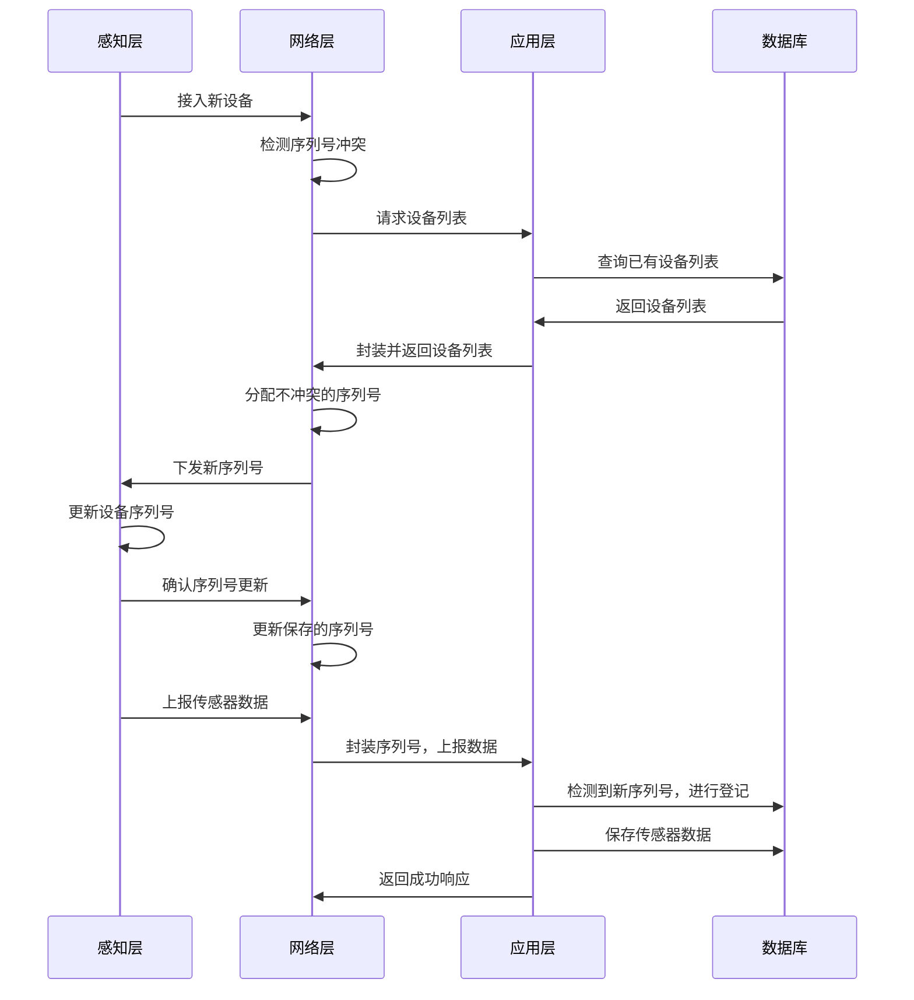

这种实现存在如下问题：

1. 当接入设备较多时，设备列表会很庞大，单次分配需要网络层请求整个列表，造成不必要的网络带宽浪费
2. 当多个设备同时接入时，有极低概率存在网络层分配到相同的设备序列号

#### 6.1.2 第二版

第二版经过综合考虑，将分配序列号的功能上升到应用层执行，具体流程如下：

感知层接入新设备时，网络层检测到设备序列号为全0,向应用层发送分配序列号的请求（`/api/distribute_seq`），应用层根据数据库中的数据，生成一个新的序列号并返回给网络层；网络层收到序列号，将序列号发送给感知层，感知层更新自己的序列号并告知网络层更新当前的序列号，用于后续通信。

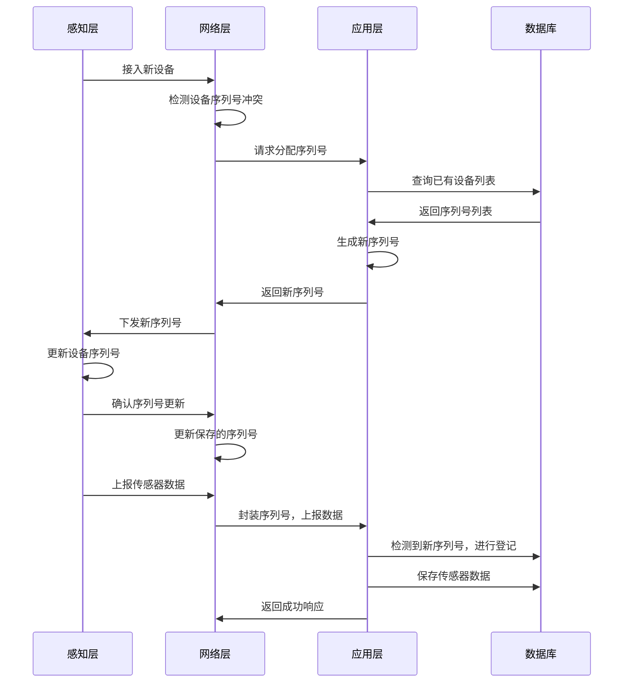

这种设计解决了第一版的第一个问题，没有解决第二个问题。但是考虑到48bit的空间比较大，可以认为这种碰撞几乎不可能发生。

### 6.2 用户管理

#### 6.2.1 用户身份认证

对于数据的管理和dashboard的访问，需要通过用户管理系统实现。当访问网页`/dashboard`路由时，会检测用户是否处于登陆状态，如果没有登陆，则会自动跳转到`admin`路由。在admin路由中输入账号密码，后端根据账号从数据库中获取对应的哈希值，并将传来的密码进行哈希后，检查两者是否匹配，如果匹配则登陆成功，添加会话的字段`username`，该字段会通过一个随机密钥进行加密后，以`cookie`的形式返回给前端，后续所有前端的请求都需要携带这一信息。具体流程如下图：

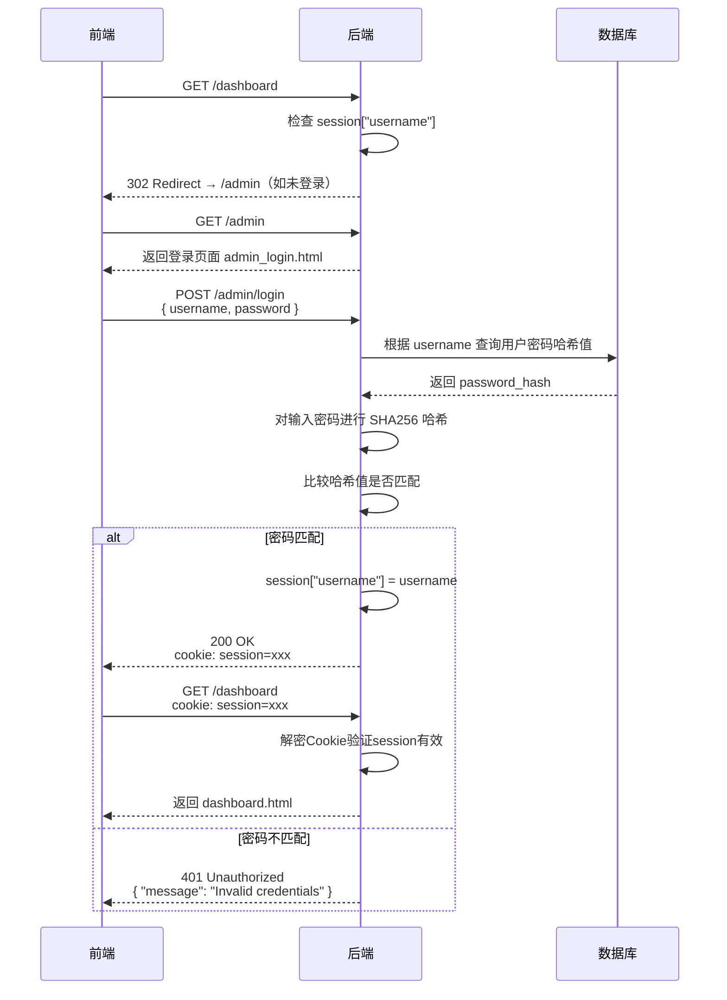

#### 6.2.2 用户自身管理

除用户可以管理数据外，还提供管理用户本身的方法：将用户分为root用户和普通用户。

普通用户与root的区别在于root除普通用户的所有权限外，还可以进行其他用户信息的增删改查。

root用户的密码是非固定的，由程序运行时随机生成。

#### 6.3.3 权限保护机制

此处为实现用户权限的方法。由于所有用户操作都集中在`dashboard`路由下，所以只需要在dashboard路由的所有处理前增加一段用户验证的处理即可。特别地，对于检查登录信息的两个路由（是否登录以及是否为root用户），对这两个路由进行放通。

```python
@dashboard_routes.before_request
def require_auth():
    """Protect all /dashboard routes - redirect to /admin if not authenticated."""
    if request.endpoint in ("dashboard.check_session_handler", "user_management.check_root_handler"):
        return

    if "username" not in session:
        return redirect("/admin")
```

```python
@user_management_bp.before_request
def require_root():
    """所有请求前检查是否为 root 用户"""
    if request.endpoint == "user_management.check_root_handler":
        return None

    username = session.get("username")
    if username != ROOT_USERNAME:
        return make_response(jsonify({"status": "error", "message": "权限不足，仅 root 用户可执行此操作"}), 403)
```

### 6.3 刷卡信息存储

对于刷卡信息的存取是本系统的一个重要功能，在SoC处于MODE1模式下，会每隔1s进行一次寻卡+防冲突获取RFID的uid。当检测到有效的uid后，感知层发送数据帧到网络层。

网络层会有一个RFID缓存表，当它收到数据帧，解析出RFID的uid，首先遍历缓存表中的数据，检查是否有数据过期（1分钟），如果过期缓存则删除。然后检查解析出的uid是否保存在缓存表中，如果存在则不进行操作；如果不存在则调用webModel的submit_card_swipe，并将rfid加入缓存表中。

调用submit_card_swipe会向应用层发送提交刷卡记录的请求，应用层首先会进行身份校验（是否完成登录），如果登录则提取请求中的设备序列号和RFID的uid，调用`db.insert_card_swipe`保存在数据库中。保存成功后，会向网络层返回成功的信息。

网络层收到应用层响应，如果为成功，则向感知层发送数据帧，告知rfid信息已经写入数据库。

感知层收到数据帧后，蜂鸣器响200ms,提示读卡成功，然后向网络层发送一个BEBUG短帧，提示应用层收到该信息。

整体流程图：

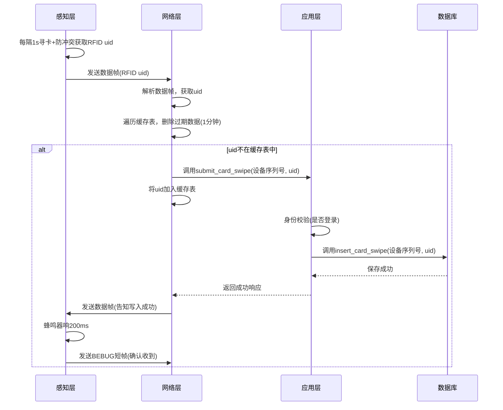

> 这部分存在一个更优的设计：uid加入缓存表的时机。当前这个设计在向应用层发送请求后就会将uid保存在缓存表中，没有考虑应用层写入失败的情况，此时没有写入成功，但是rfid仍然需要等待约1min才能重新刷卡。
>
> 一种更好的设计：在应用层成功的返回信息中携带保存的rfid信息，然后在该请求的响应中检查是否成功写入，如果成功再将uid加入缓存表，其余操作不变。
>
>  我发现这个的时候已经是最后阶段，出于写文档时不改代码设计的原则，该优化没有最终实现。

对于刷卡信息的获取，就是简单的前端调用后端API获取，为纯应用层设计，不做过多介绍。

### 6.4 扣款实现

该功能为感知层MODE2的核心，具体流程为：

感知层设置需要扣款的金额，设置好后每隔1S检测一次RFID信息，如果检测到RFID刷卡，将金额和RFID序列号上报到网络层。上报之后立即停止检测，等待上层传回数据。

网络层收到数据帧后，提取RFID和金额信息，继续上报到应用层。

应用层收到该请求，首先前往数据库查找金额表中是否存在相关的RFID信息，如果不存在则进行创建，如果存在则直接执行扣款。

应用层完成扣款后返回成功信息到网络层，网络层继续将信息发送给感知层，感知层收到成功信息后蜂鸣器响200ms，表示成功。

如未成功，蜂鸣器不会响，需要重新设置金额并刷卡。

具体流程图：

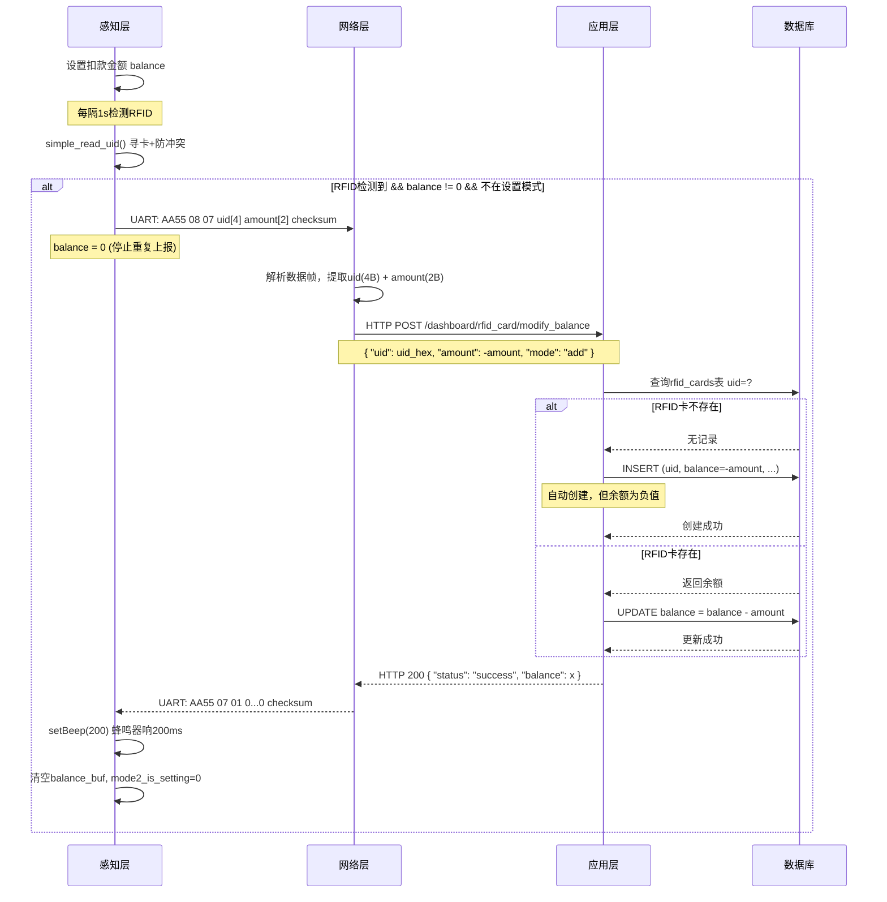


## 7 其他

### 7.1 代码获取

代码已发布在github:`https://github.com/ariyflow/rfid-item`

通过下面的方法快速开始：

```bash
git clone https://github.com/ariyflow/rfid-item.git
cd rfid-item
```

#### 7.1.1 感知层

在windows系统中，使用`keil 5`编译为hex文件，然后使用`stc-isp`程序下板即可。

#### 7.1.2 网络层

应用层和网络层的环境均使用uv进行管理，所以需要先保证python安装了uv：

```python
pip install uv
```

然后在目录`connect-layer`下运行`uv run main.py`即可。

#### 7.1.3 应用层

同样需要先保证安装uv,然后在`server-layer`目录下运行`uv run main.py`

### 7.2 LICENSE

MIT LICENSE
