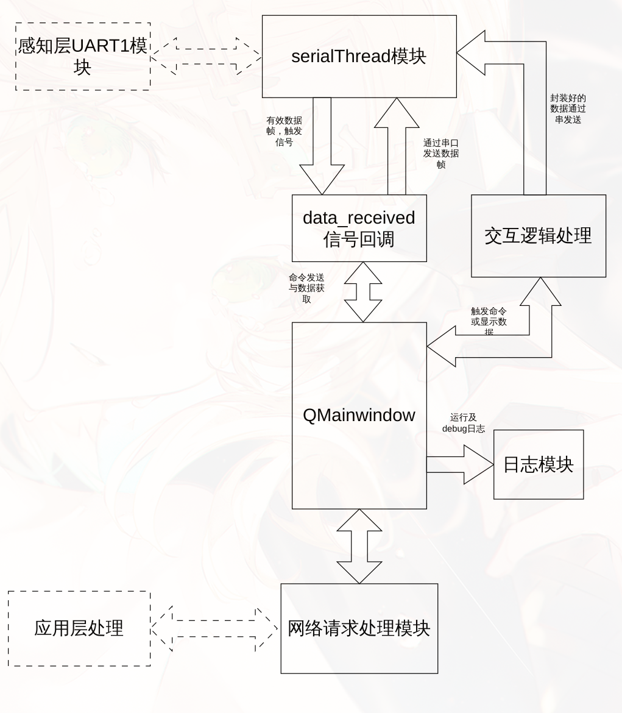

网络层功能如下：

- 感知层串口控制
- 向感知层发送命令并接收信息
- 向应用层上报信息

网络层功能概图如下：



## 程序结构

项目目录如下：（暂时）

```bash
├── main.py
├── model
│   ├── __init__.py
│   └── serialThread.py
├── pyproject.toml
├── README.md
├── scripts
│   └── checksum.py
├── test.ui
└── uv.lock
```

- main.py为程序主文件，包含主窗口定义，UI加载，交互逻辑实现，子模块控制等。
- model保存自定义的模块设计，主要是串口模块与网络请求控制模块
- scripts保存临时测试的脚本文件
- test.ui为GUI设计文件

## 感知层控制

这部分主要依赖`serialThread`与感知层串口进行通信。

- 当用户点击交互按钮后，会出发交互按键绑定的handler，然后分析交互事件并进行正确的数据帧封装，通过串口发送命令

- 当感知层返回数据时，首先在`serialThread`进行数据帧合法性检验，不符合通信协议的数据帧会被直接抛弃，符合通信协议的数据帧会通过`data_received`信号发送给`QMainWondow`并触发信号回调函数，该函数中对数据帧进行解封装处理，并将受到的数据更新到UI界面。

可进行的操作：

- 获取RFID的UID
- 获取RFID某个地址的数据
- 向RFID某个地址写入数据
- 获取传感器数据

## 应用层控制

应用层的通信主要是网络层上报传感器数据，需要提供如下信息：

- 感知层上报的传感器信息（包含温度，光照，霍尔以及时间戳）
- 上报设备的信息（序列号）

> 其中时间戳无法在感知层一侧精确获取（DS1302存在较大误差），所以时间戳获取网络层信息，存在传输的一点误差。

